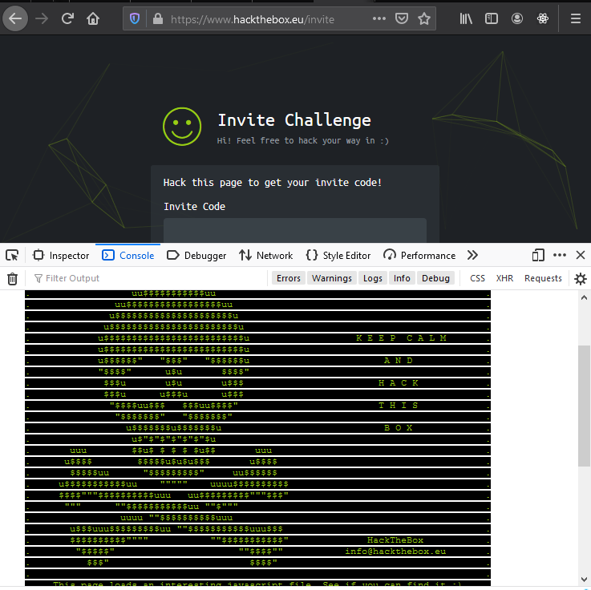
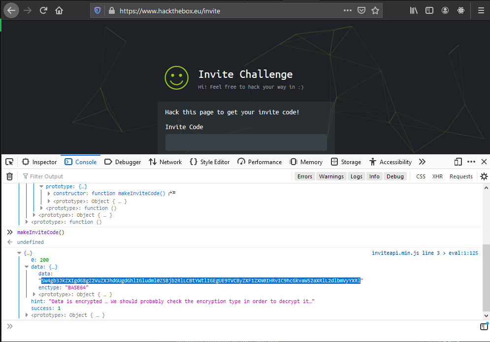
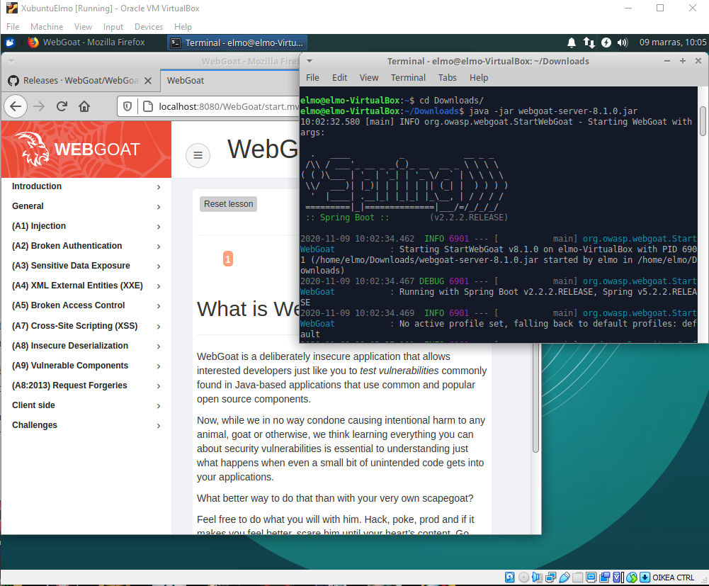
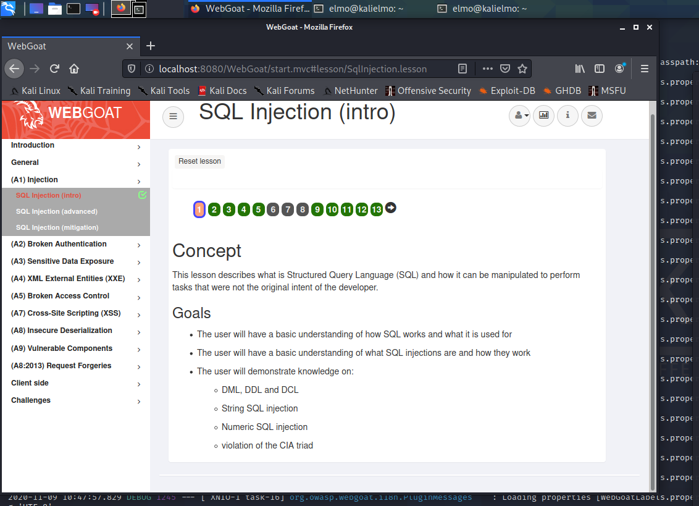

# Harjoitus 1

### a) Hanki kutsu HackTheBoxiin

Suurin osa tämän tehtävän suorituksesta tehtiin yhdessä tiistaisen luennon loppupuolella. Kutsun saaminen ei ollut hirveän monimutkainen prosessi näin jälkeenpäin katsottuna, mutta kun menetelmät olivat uusia niin niiden sisäistämisessä meni hetki.

Tehtävän ideana oli saada kutsu HackTheBox alustalle saamalla kutsukoodi jotenkin selvitettyä sivun [hackthebox.eu/invite](www.hackthebox.eu/invite) syövereistä.

Tehtävän alkuun pääsi avaamalla selaimen __Developer Tools__it ja löytämällä vinkin konsolin logista. Jokin mielenkiintoinen JavaScript-tiedosto latautuu sivun latauksen yhteydessä. Kyse on **inviteapi.min.js**-nimisestä tiedostosta.

Tiedosto piti "deobfuskoida", jotta siitä sai jotain selvää. Tämän jälkeen saimme tietoomme linkin, josta löytyisi oletettavasti vinkkejä eteenpäin. Konsolissa voi myös ajaa komennon **makeInviteCode()**, joka antaa salakirjoitetun vinkin. 

Saimme tietoomme, että lähettämällä POST-pyynnön tiettyyn osoitteeseen, saisimme vastineeksi **jotain**. Muistaakseni se, mitä saimme oli BASE64 salakirjoitettu pääsykoodi hacktheboxiin.

### Asenna WebGoat ja kokeile, että pääset kirjautumaan sisään.

Koneena harjoituksessa toimi jokin vanha luomani Xubuntu-virtuaalikone.

WebGoating asennus oli käytännössä parilla hassulla komennolla tehty. Seurasin tiukasti [Teron luomia ohjeita](http://terokarvinen.com/2020/install-webgoat-web-pentest-practice-target/).

Hain WebGoatin (ja WebWolfin) [WebGoatin julkaisusivulta](https://github.com/WebGoat/WebGoat/releases).

Käynnistin WebGoatin komennolla

	$ java -jar webgoat-server-8.1.0.jar

jonka jälkeen WebGoat alkoi pyörimään koneella paikallisesti osoitteessa **localhost:8080/WebGoat**. Rekisteröin käyttäjän ja pääsin kirjautumaan sisään!

### Ratkaise WebGoatista tehtävät "HTTP Basics", "Developer tools", "CIA Triad" ja "A1 Injection (intro)"

WebGoatin **"HTTP Basics"** ja **"CIA Triad"** onnistuivat helposti, sillä ne olivat lähinnä teoriaa ja muutamia hassuja testejä. **"Developer tools"** oli käytännössä kertausta siitä, mitä tehtiin ensimmäisen tehtävän kanssa HackTheBoxissa.

**"A1 Injection"** tarjosi jo enemmän haastetta, harmaita hiuksia ajoittain. Tehtävässä tutustuttiin SQL-injektioihin teoriassa ja käytännössä. Haastavinta ei ollut itse SQL:n syntaksi vaan se, miten sai sen "koodin" sisään. Kesti hetken ennen kuin ymmärsin miten hipsut ja tupsut asetellaan.

SQL-injektio ei ole vain SQL, vaan ymmärrystä pitää olla siitä, miten SQL ajetaan haavoittuvan sivuston koodissa, jotta hipsut, tupsut ja kommentit saadaan aseteltua oikein.

Esimerkiksi tehtävässä 12 fiktiivisen henkilön John Smithin palkka tuli päivittää korkeammaksi kuin muiden työntekijöiden. Onnistuin lopulta syöttämällä SQL-lausekkeen

	3SL99A'; UPDATE employees SET salary = '"999999999999999999"' WHERE last_name = '"Smith"' AND auth_tan = '"3SL99A"

ja palkka päivittyi. Tositilanteissa noin röyhkeä nousu palkassa herättäisi varmasti epäilyjä, mutta harjoituksessa keskityttiinkin tekniikkaan.

### Kuuntele jokin maksuvälineisiin liittyvä jakso Darknet Diaries -podcastista.

## Lähteet/linkit

1. [HackTheBoxin invite sivusto](https://www.hackthebox.eu/invite)

2. [Tero Karvinen - WebGoatin asennus](http://terokarvinen.com/2020/install-webgoat-web-pentest-practice-target/)

3. [WebGoat](https://github.com/WebGoat/WebGoat/releases)
