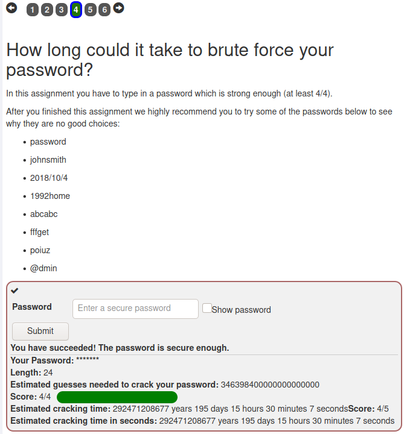
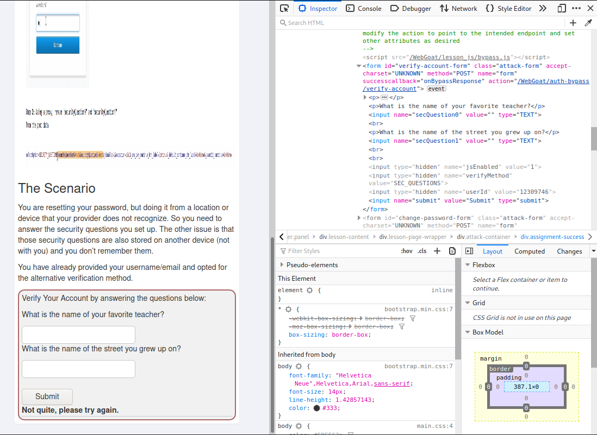
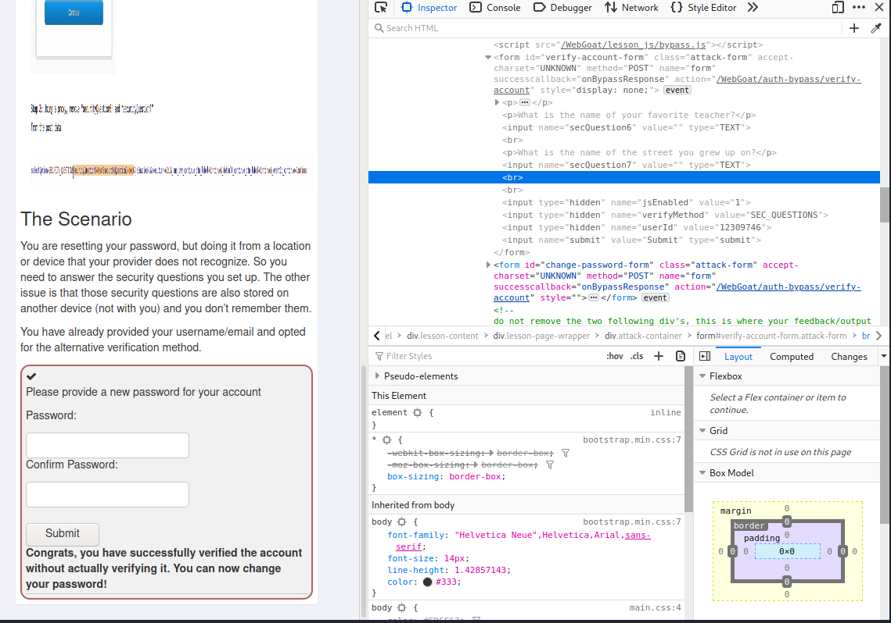
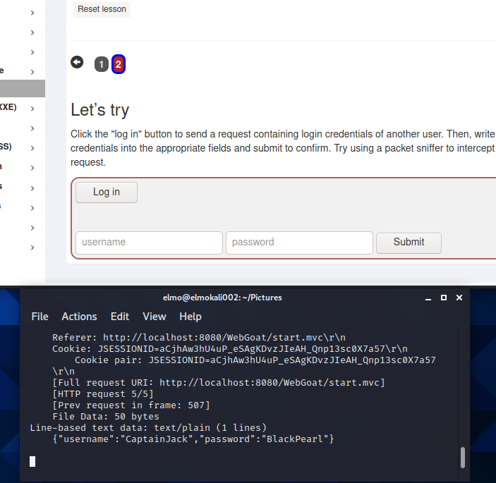
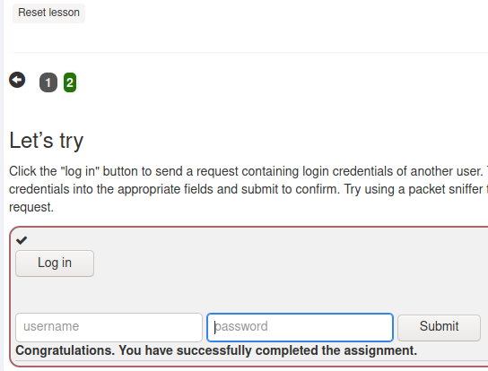
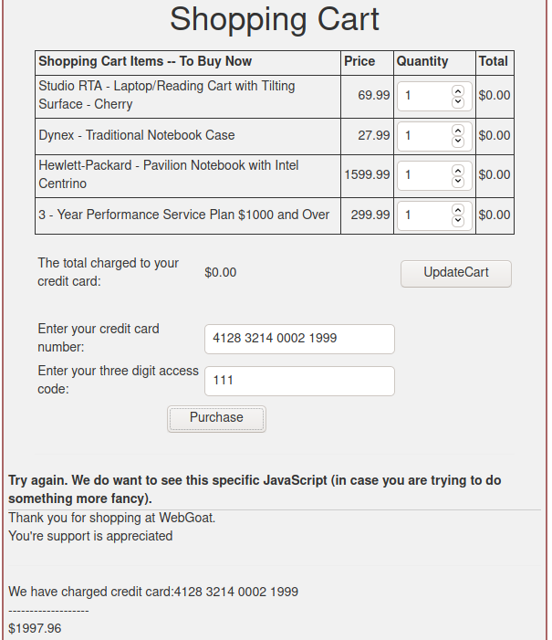
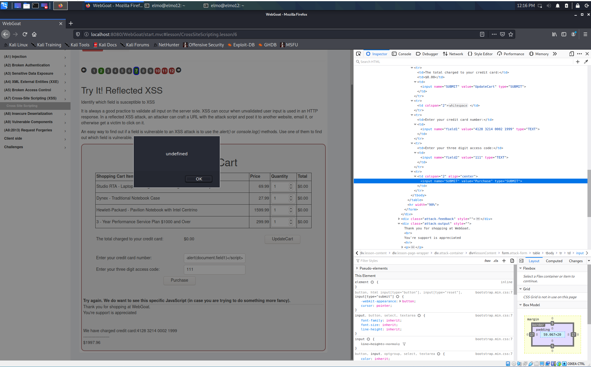
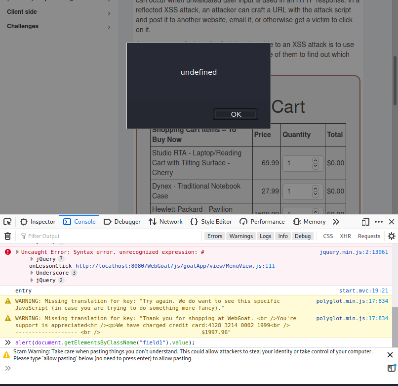
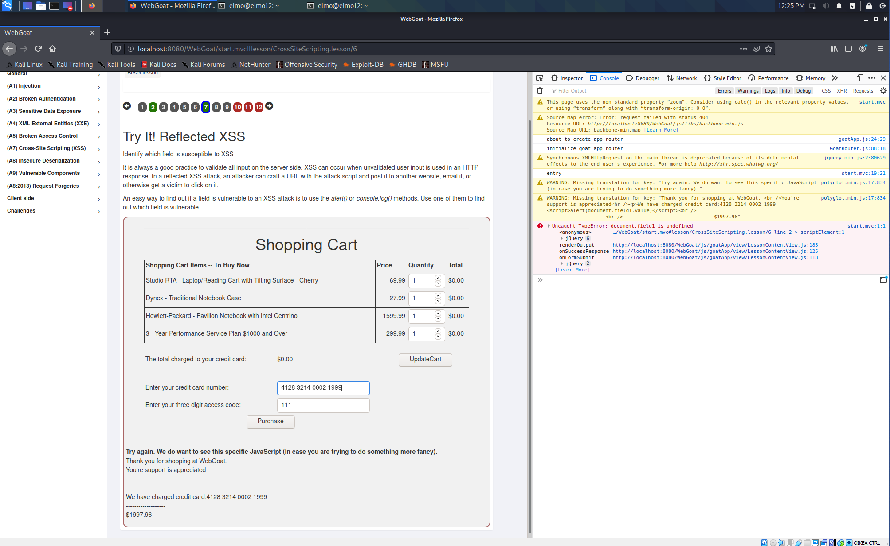
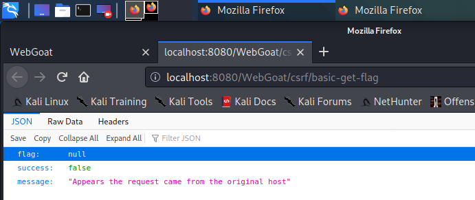

# Harjoitus 2

## Lukuläksyt

## OWASP 10:

OWASP 10 lukuläksyn aiheena oli tutustua OWASPin tarjoamaan raporttiin yleisimmistä tietojärjestelmien haavoittuvaisuuksista.

### A1 "Injection"

  * Sovellus, joka ei validoi käyttäjän syötteitä on haavoittuvainen näille hyökkäyksille.
  * Esiintyy etenkin vanhoissa, päivittämättä jätetyissä sovelluksissa, joissa esim. SQL-lausekkeiden katenointi on mahdollista syöte-kenttiin.
  * Injektio-hyökkäyksen vaikuttavuus on vaikuttavuudeltaan sitä tehokkaampi, mitä arkaluontoisempaa taikka kriittisempää tietoa sillä saadaan esille.

**Esimerkki:**

Jonkin organisaation webbipalvelun kirjautumislomake ei käytä SQL:n syöttämiseen "prepared statementejä", vaan parsii käyttäjän syötteistä lopullisen SQL-lausekkeen, joka lähtee tietokantapalvelimelle. Hyökkääjän on mahdollista lisätä syötekenttiin oma SQL-lausekkeensa lisäämällä hipsun syötteen eteen:

	' OR '1' = '1

### A2 "Broken Authentication"

  * Hyökkäys käyttää hyväksi huonosti toteutettuja käyttäjän tunnistamiskeinoja
  * Järjestelmä joka on tällaisen haavoittuvuuden alainen on sellainen jossa mm. järjestelmä sallii heikkojen salasanojen käytön, taikka loputtoman peräkkäisen tunnistautumisyrityksen sallimisen
  * Haavoittuvuuksia voidaan estää mm. vaatimalla monimutkaisia salasanoja, estämällä useamman väärän kirjautumisyrityksen putkittamisen, sekä kaksi- tai useampivaiheisen tunnistautumisen käytön tunnistautuessa palveluihin.

**Esimerkki:**

Organisaation webbipalvelun kirjautumislomake antaa käyttäjän syöttää väärän tunnuksen ja salasanan yhdistelmän niin monta kertaa kuin käyttäjä ne jaksaa syöttää. Hyökkääjä voisi käyttää apunaan tunnetuimpien käyttäjänimien ja salasanojen listoja ja "brute forcella" kokeilla niitä yksitellen jonkin ohjelmapätkän avulla. Varsinkin jos hyökkääjällä on tiedossa organisaation jäsenien oikeita kirjautumistunnuksia, on hyökkäys erittäin vaarallinen.

### A3 Sensitive Data Exposure

  * Haavoittuvuudet perustuvat kryptaamatton tiedon välitykseen eri järjestelmien välillä, josta mahdollinen hyökkääjä voi ne haistella
  * Vaikka tieto olisikin jotenkin kryptattu, eivät kaikki salakirjoitukset ole toistensa kanssa tasavertaisia ja jotkin murtuvat hetkessä nykyaikaisilla työkaluilla.
  * Haavoittuvuus voi myös ilmetä niin, että webbipalvelu tai jokin muu järjestelmä antaa ulos tietoa, jonka kuuluisi olla salaista. Esimerkiksi henkilön henkilötunnus näkyy jossain, mistä se olisi myös ulkopuolisten tahojen käytettävissä.

**Esimerkki:**

Hyökkääjä on löytänyt kohde-organisaationsa jonkin palvelimen ja päättää haistella palvelimen tietoliikennettä. Hyökkääjä onnistuu saamaan useamman käyttäjätunnuksen haltuunsa, sillä ne välittyvät organisaation sisäverkossa salakirjoittamattomana tekstinä.

### A4 XML External Entities

  * Järjestelmä on haavoittuvainen hyökkäykselle, jos hyökkääjä pääsee ujuttamaan vihamielisiä XML-tiedostoja järjestelmien käsiteltäväksi.
  * Nykyaikana harvinaisempi haavoittuvuus
  * XXE:lle haavoittuvainen järjestelmä on todennäköisesti myös haavoittuvainen palvelunestohyökkäyksille

**Esimerkki:**

Suojaamattomassa palvelussa, jossa hyökkääjä voi ujuttaa XML:ää järjestelmään ja pyytää vaikkapa salasanoja sisältävän tiedoston tulostettavaksi. [Kohdassa "Exokiutub XXE to retrieve files"](https://portswigger.net/web-security/xxe).

### A5 Broken Access Control

  * Haavoittuvassa järjestelmässä hyökkääjä pystyy erinäköisten keinojen avulla toimimaan järjestelmässä oikeuksilla, joilla hänen ei tulisi pystyä toimimaan.
  * Jos esimerkiksi muokkaamalla webbipalvelun URL:ia tavallinen käyttäjä pääsee järjestelmänvalvojan hallintapaneeliin on kyseessä tämä haavoittuvuus.

**Esimerkki:**

Hyökkääjä pääsee organisaation webbipalvelussa käyttämään hänelle kuulumatonta käyttäkätunnusta muokkaamalla URL:ia. Syöttämällä **acc:n** parametriksi **1234**, hyökkääjä pääsee näkemään tuon käyttäjän tiedot

	https://www.bigcorp.com/app/accinfo?acc=1234

### A6 Security Misconfiguration

  * Järjestelmä on haavoittuvainen jos suojauksen mahdollistavat ohjelmat ovat konfiguroitu väärin tai puutteellisesti.
  * Haavoittuvassa järjestelmässä saattaa olla turhia palveluita, jotka lisävät hyökkäysrajapintaa
  * Päivittämättömät järjestelmät voivat olla haavoittuvia jo löydettyihin hyökkäyksiin, jos niitä ei ole päivitetty suojauksiltaan ajan tasalle.

**Esimerkki:**

Organisaation tuotantopalvelimelle on jäänyt vanhoja ohjelmia pyörimään, eikä niitä olla muistettu poistaa tai konfiguroida turvallisiksi. Hyökkääjä pääsee hyödyntämään näitä hyökkäyksessään jo tunnettujen haavoittuvuuksien kautta.

### A7 Cross-Site Scripting

  * "Reflected XSS": Sovellus mahdollistaa hyökkääjän ajamaan haluamaansa HTML ja JavaScript koodia urhin selaimella.
  * "Stored XSS": Ohjelma/palvelu tallettaa käyttäjän syötteitä, joita joku ulkopuolinen pääsee myöhemmin tarkastelemaan
  * "DOM XSS": Haavoittuvuudet voivat johtaa mm. monivaiheisen tunnistautumisen tai vihamielisen ohjelmiston lataukseen uhrin koneelle.
  * Pääpiirteittän, haavoittuvainen järjestelmä sallii hyökkääjän käyttää joko ulkopuolisten organisaatioiden webbipalveluja, taikka hyökkäykseen tarkoituksella luotuja vihamielisiä sivustoja.

**Esimerkki:**

Katso tästä harjoituksesta kohta **Get Basic CSRF**

### A8 Insecure Deserialization

_Tätä kohtaa en tosissani oikein ymmärtänyt_

### A9 Using Components with Known Vulnerabilities

  * Pätee lähinnä vanhoihin ohjelmistoversioihin, joihin on ajan kanssa löytynyt haavoittuvuuksia. Järjestelmissä päivittämättä jääneet ohjelmat ja komponentit ovat ajan kanssa kasvava riski
  * Valmiiden hyökkäyksien hyväksikäyttö on yleistä, sillä hyökkääjän on helppo toteuttaa hyökkäyksensä jos hän löytää jo valmiin hyökkäyksen kohteelleen ilman sen kummempia kustomointeja.
  * Yksi helpoimmista estokeinoista on ohjelmistojen ajan tasalla pitäminen

**Esimerkki:**

Hyökkäääjä huomaa kohdetta tiedustellessaan porttiskannaamalla, että kohteesta löytyy verkkoon avoimia, vanhoja palveluja. Hän löytää näihin nopeasti valmiin hyökkäyksen ja pääsee käsiksi järjestelmiin.

### A10 Isufficient Logging & Monitoring

  * Osana useimpia hyökkäyksiä, sillä hyökkääjät pyrkivät huomaamattomuuteen, sekä luottavat huonoon palvelujen valvontaan
  * Järjestelmä on haavoittuvainen, jos palvelin pitää huonoa lokia, tai ei pidä lokia ollenkaan mm. kirjautumisista
  * Järjestelmä on haavoittuvainen jos se ei hälytä tai huomio sille tuntemattomista kohteista tulevia pyyntöjä

**Esimerkki:**

Hyökkääjä onnistuu saamaan organisaation tiedostopalvelimen haltuunsa. Hyökkääjä huomaa, että organisaatio ei ole reagoinut murtoon kuukausiin ja päättää tästä innostuneena alkaa etsimään organisaation muita mahdollisia palvelimia siinä toivossa, että valvonta on niissäkin yhtä huonoa.

# WebGoat harjoitukset

Tässä osassa päästään tekemään asioita konkreettisesti WebGoatin avulla.

Harjoituksissa käytin 64-bittistä Linux Kalia, jonka olin pystyttänyt aikaisemmin.

## A2 Broken Authentication

### Secure Passwords

Tehtävä oli lähinnä teoriaa. Kuitenkin yhdessä kohdassa sai luoda itselleen salasanan ja katsoa, kuinka kauan luomasi salasanan murtamiseen menisi.

### Authentication Bypasses / 2FA Password Reset

Tehtävässä on tarkoitus ohittaa käyttäjätunnuksen varmistus jollain keinolla. Osasin veikata heti alkuun, että lomakesivun **HTML**:ssä olisi joitain piilotettuja **inputteja**.

Sieltä tosiaan löytyi jotain!

En osannut itse lähteä selvittämään tätä tämän pidemmälle, joten katsoin sivun yläkulmasta vinkkejä. Sivu ehdottaa muuttamaan lomakkeen **secQuestion0** ja **secQuestion1** parametrien nimiä.

Nimesin edellämainitut parametrit nimillä **secQuestion6** ja **secQuestion7**. Painoin lomakkeen **Submit**-painiketta ja tehtävä ratkesi!

_Kommentti: Olin tehnyt tämän tehtävän aikaisemminkin kokeilumielessä, enkä silloin jostain syystä saanut millään tehtävää läpi, vaikka nimesin lomakkeen parametrit uudelleen. Olin kokeillut hidden inputtien muuttamista, mutten muista mitä kokeilin, sillä unohdin tehdä muistiinpanoja siitä._

## A3 Sensitive Data Exposure

### Insecure Login

Terolla oli sivuillaan vinkki tämän tehtävän tekoon. Tehtävä vaatisi jotain paketti nuuskijaa. Ajoin Teron ohjeiden mukaisesti seuraavan komennon:

	$ sudo tshark -i any -V -Y 'http.request.method == POST'

Komento käynnistäisi **wiresharkin** ja kuuntelisi kaikkia **POST** pyyntöjä. Painoin seuraavaksi sivulla näkyvää "Log in"-painiketta ja wireshark ilmoitti, että jotain on tarttunut haaviin.

Sieltähän löytyi salakirjoittamattomana tekstinä suoraan kirjautumistunnukset

	Käyttäjänimi: CaptainJack
	Salasana: BlackPearl

Syöttämällä nämä sivun lomakkeeseen tuli tehtävä ratkaistuksi.

## A7 Cross-Site Scripting (XSS)

### Try It! Reflected XSS

Aloitin avaamalla dev toolit F12. Ajoin lomakkeen kerran läpi jo annetuilla arvoilla ja katsoin, millaisen viestin sain.

Heti hälytti, sillä selain tulostaa käyttäjälle syötteen, jossa on kentästä "Enter your creddit card number" käyttäjän syöttämä luottokortin tunnus. Tämän oltiin sanottu olevan yksi mahdollinen hyökkäyksen mahdollistavista paikoista.

Seuraavaksi olisi aika etsiä sopivaa hyökkäyspintaa.

Katsoin **Dev-toolsien** **Network**-välilehdestä, jos lähettämäni pyyntö olisi antanut jotain jännää. Ei ainakaan mikään osunut silmään. Arvelen, että tulisi taas muokata itse **HTML**:ää, jotta saisin jonkin **JavaScript**-pätkän ajettua. _(Try again. We do want to see this specific JavaScript (in case you are trying to do something more fancy)_.

Ajoin seuraavaksi pari komentoa dev-toolsien konsolissa, ihan bruteforce mielessä, ilman kummempaa taka-ajatusta.

    alert(/WebGoat/CrossSiteScripting/attack5a);
    alert(document./WebGoat/CrossSiteScripting/attack5a);

Ajattelin tämän antavan jotain vänkää ulos, mutta eipä tullut.

Katsoin pari vinkkiä sivun yläkulmasta. Vinkit antoivat jo pari sellaista mitä olin oivaltanut itse (mikä tieto "echotaan" takaisin käyttäjälle), mutta sitten tajusin, että minun pitäisi syöttää haluamani **JavaScript** johonkin tekstikenttään sen ajamiseksi. Katsoin takaperin ohjeita ja vinkkejä harjoituksen muista kohdista ja mietin, voisinko laitaa **`

Ei tuottanut haluttua lopputulosta, mutta alert näkyi!

Seuraavaksi kokeilin:

    

Tällä tehtävä meni läpi, mutta mitään ei tapahtunut.

Ajoin seuraavan **dev-toolsin** konsolissa, mutta sain tulokseksi undefined:

	alert(document.getElementsByClassName("field1").value);

Tajusin, että hain väärällä tapaa **field1**:n arvoa. Olisi pitänyt hakea **getElementsByName**:lla, sillä **getElementsByClassName** hakee classin nimen mukaan. **getElementsByName** palauttaa myös kaikki instanssit listana (tai näin ymmärsin), joten olisi tarvinnut määritellä, mikä instanssi noista **field1**:stä palautetaan (**getElementsByName('foobar')[0].value**).

Kokeilin vielä seuraaviakin syötteitä, mutta saamatta sen kummempia tuloksia.

    

    

    

## A8:2013 Request Forgeries

### Basic Get CSRF:

Avasin myös **WebWolf**in taustalle

    $ java -jar webwolf-se-ja-se

**WebWolf** aukeaa osoitteeseen **localhost:9090/WebWolf**. Toimii erillisenä työkaluna **WebGoatin** kanssa. Tarkoituksena olisi ajaa **WebGoatin** liikennettä niin, että se päätyisi **WebWolfiin**.

*Kommentti tehtävän teon jälkeen: eihän tuota webwolfia itseasiassa tarvinnutkaan tehtävän suoritukseen*

painettuani **Submit Query**-painiketta, avasi webgoat uuden välilehden jossa ilmoitettiin, etten ollut onnistunut, sillä pyyntö tuli samalta hostilta. Minun pitäisi jostain saada siis "painettua" query selaimen ulkopuolelta tai toisen sivun kautta, jotta onnistuisin.

Löysin Inspectorista formista kohdan "target". Tämä vaikuttaisi suuntaavaan queryn tiettyyn paikkaan. Lueskelin lisää [täältä](https://www.w3schools.com/tags/att_form_target.asp)

targetin muuttaminen **http://webwolf/landing/** muotoon ei tarjonnut vastausta. Tajusin, että eihän tässä pyydetä lomakkeen tietojen lähetystä ulos, vaan lomakkeen "submittausta" ulkopuolelta.

Loin nopeasti webbisivun **attack.html** johon sijoitin:

    <!DOCTYPE html>
    <html lang="en">
    <head></head>
    <body>
        <h1>ATTACK!!!</h1>
        <form method="post" action="localhost:8080/WebGoat/csrf/confirm-flag-1">
            <input type="submit" value="ATTACK">
        </form>
    </body
    </html>

Sivun tarkoituksena on lähettää sama pyyntö, kuin mitä kohde sivu lähettää "**Submit Query**"-painikkeesta.

Pistin seuraavaksi helpon serverin pystyyn [Teron ohjeilla](http://terokarvinen.com/2020/tunkeutumistestaus-kurssi-pentest-course-ict4tn027-3006-autumn-2020/), jos sillä vaikka tapahtuisi.

    $ python3 -m http.server

ja navigoin tiedostoon **attack001.html** - joka oli alkuperäisestä **attack.html**:stä tekemäni kopio - käyttäen tuota palvelintani, joka aukesi porttiin **8000** (attack001.html oli alkuperäinen)

kuitenkin sivusto ilmoitti virhettä syötteessä: _Kommentti tehtävän teon jälkeen: syötteen charset encoding on aika irrelevanttia tässä tapauksessa. Huomiota olisi tullut kiinnittää kuvassa näkyvään alempaan virheilmoitukseen._

Lisäsin **attack001.html**:n formiin **"accept-charset='unknown'"**, sekä otin **action:stä** pois **localhostin** ja **portin**. Sain erilaisen virheilmoituksen. Sanoo, ettei **POST** toimi. Taidampa kokeilla **GET**iä.

HUOMASIN TÄSSÄ VAIHEESSA, että olin tuijottanut **Confirm Flag formin** koodia inspectorissa ja käyttäytynyt sen mukaan. Ei ihme, ettei mikään pelitä. Tässä oli parin **voimasanan mittainen huokaustuokio**.

Katsoin parit vinkit sivun yläpalkista ja siellä sanottiin, että formissa on piilotettuja inputteja. Toden totta siellä olikin ja lisäsin tuon inputin omaan webbisivuuni. Formin targetiksi laitoin **"_blank"**, sekä ohjasin pyynnön **"localhost:8080/WebGoat....."**, että POST menisi suoraan oikealle palvelimelle.

_Kommentti tehtävän teon jälkeen: seuraavaan koodipätkään lisätty "body"-tägin päätteeksi ">", joka puuttui alkuperäisestä tiedostosta. Virhe näkyy kuvankaappauksissa. Tämä ei kuitenkaan jostain syystä vaikuttanut tehtävän tekoon._

    <!DOCTYPE html>
    <html lang="en">
    <head></head>
    <body>
        <h1>ATTACK!!!</h1>
        <form method="POST" accept-charset="UNKNOWN" action="http://localhost:8080/WebGoat/csrf/basic-get-flag" target="_blank">
            <input type="submit" value="ATTACK">
            <input name="csrf" type="hidden" value="false">
        </form>
    </body>
    </html>

Onnistuin saamaan vastauksen!

Laitoin vastauksessa tulleen flagin alempaan lomakkeeseen ja sain onnistuneesti tehtävän läpi.

## Lähteet

  * 1: PortSwigger, tietoa XXE-hyökkäyksistä: [PortSwigger](https://portswigger.net/web-security/xxe)
  * 2: W3schools Javan opetteluun: [W3](https://www.w3schools.com/tags/att_form_target.asp)
  * 3: Tehtävänanto H2, vinkki helpon python-palvelimen pystytykseen: [Tero Karvinen](http://terokarvinen.com/2020/tunkeutumistestaus-kurssi-pentest-course-ict4tn027-3006-autumn-2020/)
  * 4: Mozilla Firefox, JS käytön dokumentaatiota [Mozilla](https://developer.mozilla.org/en-US/docs/Web/API/Document/getElementsByClassName)

Elmo Rohula 2020