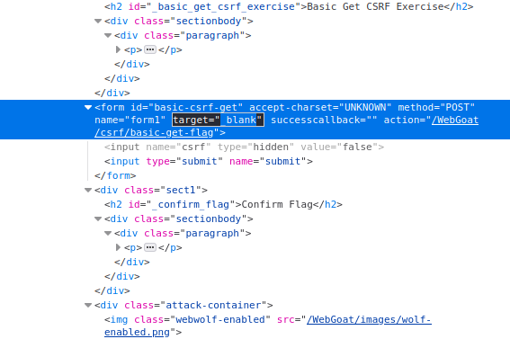
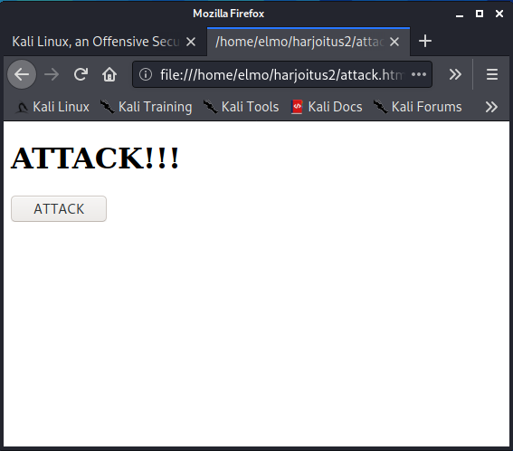
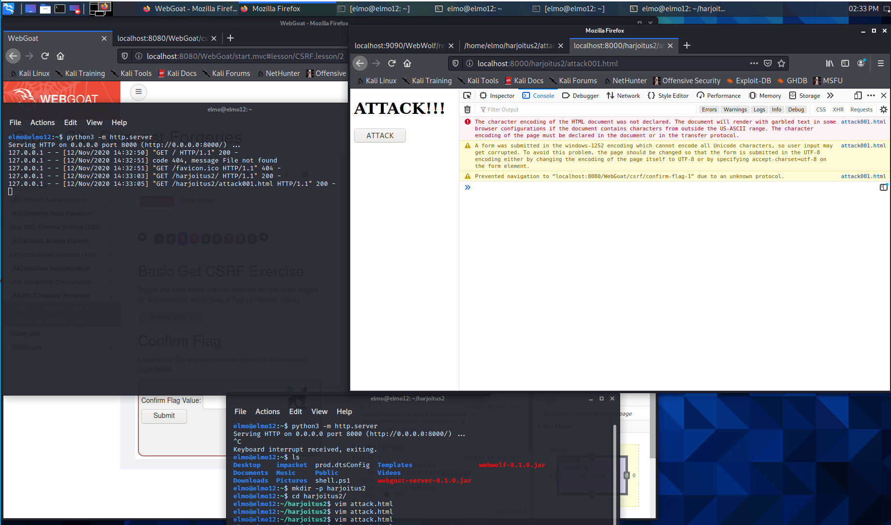
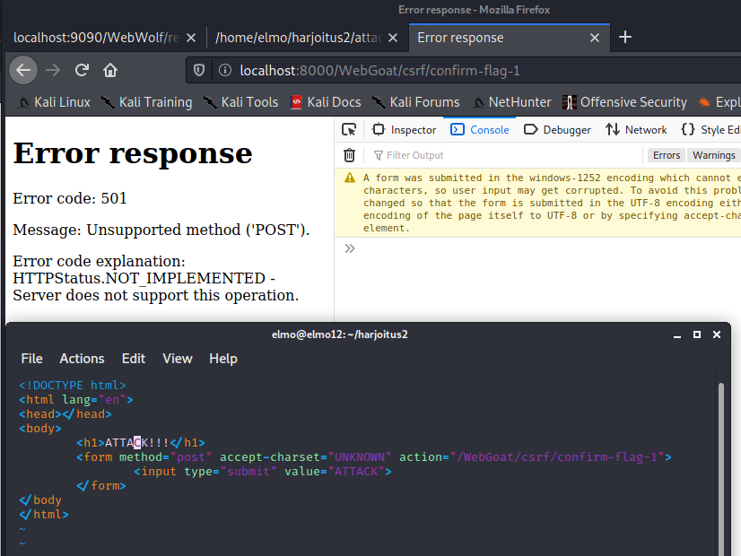
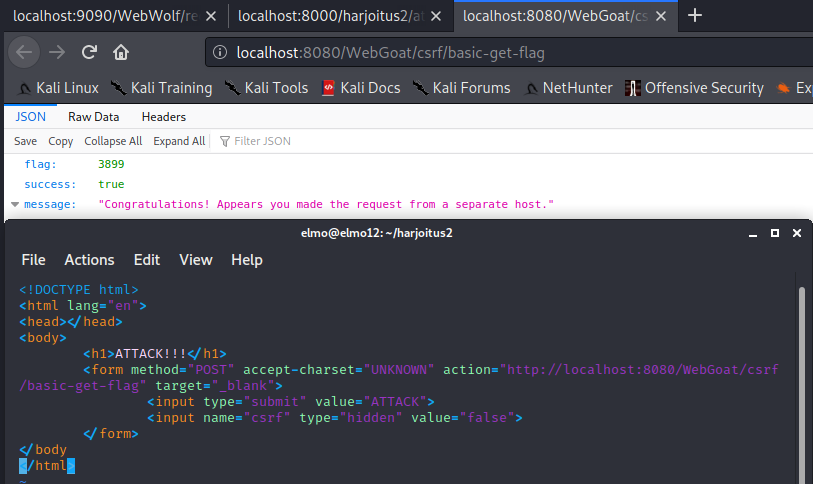
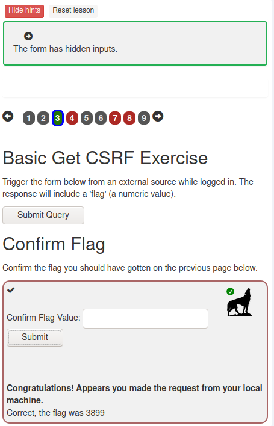

# !!!! TYÖN ALLA !!!!

# Harjoitus 2

## Elmo Rohula

# Lukuläksyt

## OWASP 01:

**A1 "Injection"**

  * Sovellus, joka ei validoi käyttäjän syötteitä on haavoittuvainen näille hyökkäyksille.
  * Esiintyy etenkin vanhoissa, päivittämättä jätetyissä sovelluksissa, joissa esim. SQL-lausekkeiden katenointi on mahdollista syöte-kenttiin.
  * Injektio-hyökkäyksen vaikuttavuus on vaikuttavuudeltaan sitä tehokkaampi, mitä arkaluontoisempaa taikka kriittisempää tietoa sillä saadaan esille.

**Esimerkki:**

Jonkin organisaation webbipalvelun kirjautumislomake ei käytä SQL:n syöttämiseen "prepared statementejä", vaan parsii käyttäjän syötteistä lopullisen SQL-lausekkeen, joka lähtee tietokantapalvelimelle. Hyökkääjän on mahdollista lisätä syötekenttiin oma SQL-lausekkeensa lisäämällä hipsun syötteen eteen:

	' OR '1' = '1

**A2 "Broken Authentication"**

  * Hyökkäys käyttää hyväksi huonosti toteutettuja käyttäjän tunnistamiskeinoja
  * Järjestelmä joka on tällaisen haavoittuvuuden alainen on sellainen jossa mm. järjestelmä sallii heikkojen salasanojen käytön, taikka loputtoman peräkkäisen tunnistautumisyrityksen sallimisen
  * Haavoittuvuuksia voidaan estää mm. vaatimalla monimutkaisia salasanoja, estämällä useamman väärän kirjautumisyrityksen putkittamisen, sekä kaksi- tai useampivaiheisen tunnistautumisen käytön tunnistautuessa palveluihin.

**Esimerkki:**

Organisaation webbipalvelun kirjautumislomake antaa käyttäjän syöttää väärän tunnuksen ja salasanan yhdistelmän niin monta kertaa kuin käyttäjä ne jaksaa syöttää. Hyökkääjä voisi käyttää apunaan tunnetuimpien käyttäjänimien ja salasanojen listoja ja "brute forcella" kokeilla niitä yksitellen jonkin ohjelmapätkän avulla. Varsinkin jos hyökkääjällä on tiedossa organisaation jäsenien oikeita kirjautumistunnuksia, on hyökkäys erittäin vaarallinen.

**A3 Sensitive Data Exposure**

  * Haavoittuvuudet perustuvat kryptaamatton tiedon välitykseen eri järjestelmien välillä, josta mahdollinen hyökkääjä voi ne haistella
  * Vaikka tieto olisikin jotenkin kryptattu, eivät kaikki salakirjoitukset ole toistensa kanssa tasavertaisia ja jotkin murtuvat hetkessä nykyaikaisilla työkaluilla.
  * Haavoittuvuus voi myös ilmetä niin, että webbipalvelu tai jokin muu järjestelmä antaa ulos tietoa, jonka kuuluisi olla salaista. Esimerkiksi henkilön henkilötunnus näkyy jossain, mistä se olisi myös ulkopuolisten tahojen käytettävissä.

**Esimerkki:**

Hyökkääjä on löytänyt kohde-organisaationsa jonkin palvelimen ja päättää haistella palvelimen tietoliikennettä. Hyökkääjä onnistuu saamaan useamman käyttäjätunnuksen haltuunsa, sillä ne välittyvät organisaation sisäverkossa salakirjoittamattomana tekstinä.

**A4 XML External Entities**

# XSS iso teht:

Aloitin avaamalla dev toolit F12. Ajoin lomakkeen kerran läpi jo annetuilla arvoilla ja katsoin, millaisen viestin sain.

Heti hälytti, sillä selain tulostaa käyttäjälle syötteen, jossa on kentästä "Enter your creddit card number" käyttäjän syöttämä luottokortin tunnus. Tämän oltiin sanottu olevan yksi mahdollinen hyökkäyksen mahdollistavista paikoista.

Seuraavaksi olisi aika etsiä sopivaa hyökkäyspintaa.

Katsoin Devtoolsien Network välilehdestä, jos lähettämäni pyyntö olisi antanut jotain jännää. Ei ainakaan mikään osunut silmään. Arvelen, että tulisi taas muokata itse HTML:ää, jotta saisin jonkin Javascript pätkän ajettua. (Try again. We do want to see this specific JavaScript (in case you are trying to do something more fancy).

Ajoin seuraavaksi pari komentoa, ihan vruteforce mielessä, ilman kummempaa taka-ajatusta.

    alert(/WebGoat/CrossSiteScripting/attack5a);
    alert(document./WebGoat/CrossSiteScripting/attack5a);

Ajattelin tämän antavan jotain vänkää ulos, mutta eipä tullut.

Katsoin pari vinkkiä sivun yläkulmasta. Vinkit antoivat jo pari sellaista mitä olin oivaltanut itse (mikä tieto "echotaan" takaisin käyttäjälle), mutta sitten tajusin, että minun pitäisi syöttää haluamani JS johonkin tekstikenttään sen ajamiseksi. Katsoin takaperin ohjeita ja vinkkejä harjoituksen muista kohdista ja mietin, voisinko laitaa ` // ei toiminut, mutta alert näkyi! (xss_alert001)

     // tehtävä meni läpi, mutta mitään ei näkynyt

alert(document.getElementsByClassName("field1").value); ajettu consolessa, palautti undefined

TAJUSIN ETTÄ:
    - hain väärällä tapaa field1:n arvoa. Olisi pitänyt hakea getElementsByName:lla, sillä getElementsByClassName hakee classin nimen mukaan. getElementsByName palauttaa myös kaikki instanssit listana (???) joten olisi tarvinnut määritellä, mikä instanssi noista field1:stä palautetaan (getElementsByName('foobar')[0].value).

loppuun xss_alert002.png

LISÄYSTÄ:

Kokeiltu, ei feedbäkkiä

    

    

    

LÄHTEET: https://developer.mozilla.org/en-US/docs/Web/API/Document/getElementsByClassName Tsekkasin JS,
https://www.w3schools.com/jsref/met_doc_getelementsbyname.asp kokeiluja

# XS REQUEST FORGERY:

## Basic Get CSRF:

Avasin myös webwolfin taustalle

    $java -jar webwolf-se-ja-se
    localhost:9090/webwolf
    incoming requests

*Kommentti tehtävän teon jälkeen: eihän tuota webwolfia itseasiassa tarvinnutkaan tehtävän suoritukseen*

painettuani get query, avasi webgoat uuden välilehden jossa ilmoitettiin, etten ollut onnistunut, sillä pyyntö tuli samalta hostilta (KUVA seasurf001). Minun pitäisi jostain saada siis "painettua" query selaimen ulkopuolelta tai toisen sivun kautta, jotta onnistuisin.

Löysin Inspectorista formista kohdan "target". Tämä vaikuttaisi suuntaavaan queryn tiettyyn paikkaan. https://www.w3schools.com/tags/att_form_target.asp

(KUVA seasurf002)

targetin muuttaminen **http://webwolf/landing/*** muotoon ei tarjonnut vastausta. Tajusin, että eihän tässä pyydetä lomakkeen tietojen lähetystä ulos, vaan lomakkeen "submittausta" ulkopuolelta.

Loin nopeasti webbisivun **attack.html** johon sijoitin:

    <!DOCTYPE html>
    <html lang="en">
    <head></head>
    <body>
        <h1>ATTACK!!!</h1>
        <form method="post" action="localhost:8080/WebGoat/csrf/confirm-flag-1">
            <input type="submit" value="ATTACK">
        </form>
    </body
    </html>

Sivun tarkoituksena on lähettää sama pyyntö, kuin mitä kohde sivu lähettää "**Submit Query**"-painikkeesta.

Pistin seuraavaksi helpon serverin pystyyn, jos sillä vaikka tapahtuisi[1](http://terokarvinen.com/2020/tunkeutumistestaus-kurssi-pentest-course-ict4tn027-3006-autumn-2020/).

    $ python3 -m http.server

ja navigoin tiedostoon **attack001.html** - joka oli alkuperäisestä **attack.html**:stä tekemäni kopio - käyttäen tuota palvelintani, joka aukesi porttiin **8000** (attack001.html oli alkuperäinen)

kuitenkin sivusto vinkui virhettä syötteessä: _Kommentti tehtävän teon jälkeen: syötteen charset encoding on aika irrelevanttia tässä tapauksessa. Huomiota olisi tullut kiinnittää kuvassa näkyvään alempaan virheilmoitukseen._ (seasurf003).

LISÄSIN attack001.html:ään formiin **"accept-charset='unknown'"**, sekä otin **action:stä** pois **localhostin** ja **portin**. Sain erilaisen virheilmoituksen. Sanoo, ettei POST toimi. Taidampa kokeilla **GET**iä.

HUOMASIN TÄSSÄ VAIHEESSA, että olin tuijottanut **Confirm Flag formin** koodia inspectorissa ja käyttäytynyt sen mukaan. Ei ihme, ettei mikään pelitä. Tässä oli parin **voimasanan mittainen huokaustuokio**.

Katsoin parit vinkit sivun yläpalkista ja siellä sanottiin, että formissa on piilotettuja inputteja. Toden totta siellä olikin ja lisäsin tuon inputin omaan webbisivuuni. Formin targetiksi laitoin **"_blank"**, sekä ohjasin pyynnön **"localhost:8080/WebGoat....."**, että POST menisi suoraan oikealle palvelimelle.

_Kommentti tehtävän teon jälkeen: seuraavaan koodipätkään lisätty "body"-tägin päätteeksi ">", joka puuttui alkuperäisestä tiedostosta. Virhe näkyy kuvankaappauksissa. Tämä ei kuitenkaan jostain syystä vaikuttanut tehtävän tekoon._

    <!DOCTYPE html>
    <html lang="en">
    <head></head>
    <body>
        <h1>ATTACK!!!</h1>
        <form method="POST" accept-charset="UNKNOWN" action="http://localhost:8080/WebGoat/csrf/basic-get-flag" target="_blank">
            <input type="submit" value="ATTACK">
            <input name="csrf" type="hidden" value="false">
        </form>
    </body>
    </html>

Onnistuin saamaan vastauksen!

Laitoin vastauksessa tulleen flagin alempaan lomakkeeseen ja sain onnistuneesti tehtävän läpi.

## Lähteet

1: Tehtävänanto, vinkki helpon python-palvelimen pystytykseen: [Tero Karvinen](http://terokarvinen.com/2020/tunkeutumistestaus-kurssi-pentest-course-ict4tn027-3006-autumn-2020/)
