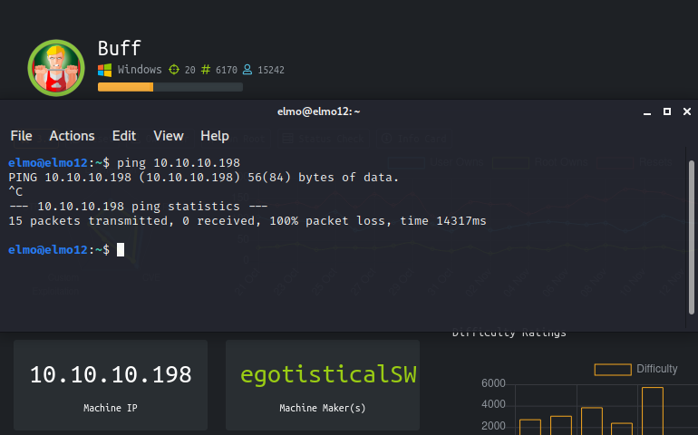
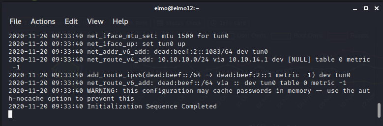
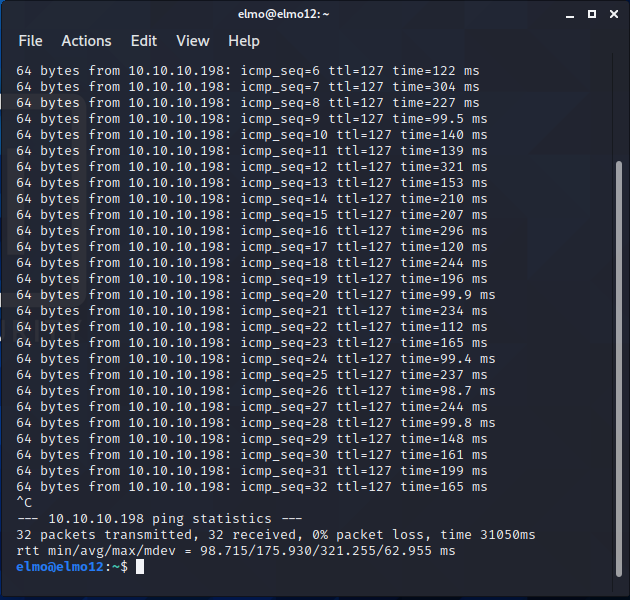
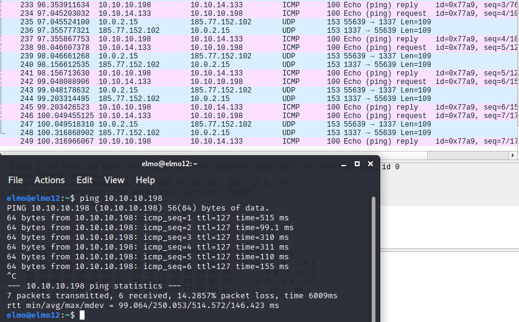
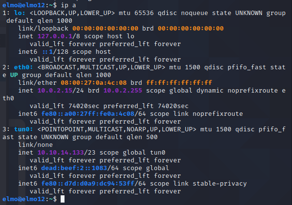
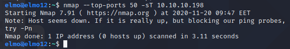
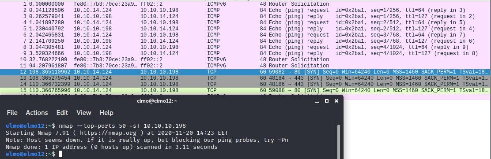

# Harjoitus 3

Harjoituksessa 3 opetellaan käyttämään **nmap**-porttiskanneria, tulkitsemaan sen toimintaa **snifferin** avulla ja tarkastelemaan sen moninaisia toiminnalisuuksia. [Linkki tehtävänantoon](http://terokarvinen.com/2020/tunkeutumistestaus-kurssi-pentest-course-ict4tn027-3006-autumn-2020/#h3). Tehtävän tekoon käytän jo aiemmin asentamaan **Linux Kali**-virtuaalikonetta.

## Lukuläksyt (kohta z)

_Lue artikkelit ja katso videot, tee kustakin muistiinpanot (muutama ranskalainen viiva per artikkeli/video). Tässä z-kohdassa ei tarvitse tehdä mitään kokeita koneella._

### Santos et al: The Art of Hacking - Active Reconnaissance

### 4.1 ja 4.2

  * Aktiivinen tiedustelu eroaa passiivisesta tiedustelusta sillä, että hyökkääjä/tunkeutuja/testaaja pyrkii aktiivisesti eri keinoin ja työkaluin hankkimaan tietoa uhrista/kohteesta ja/tai tämän tietoverkoista.
  * Kohteiden tiedustelussa on tärkeää laittaa muistiin tiedot tiedustelluista kohteista
  * Aktiivisen tiedustelun vaiheita ovat mm. porttiskannaus, webbipalveluiden silmäily, sekä haavoittuvuuksien kartoitus.

### 4.3

**Porttiskannaus**

  * Työkaluista tärkeimmät porttiskannauksessa ovat **nmap** yleistä porttiskannausta ja version nuuhkintaa varten, **masscan** suuria porttimääriä skannatessa, sekä **udpprotoscanner** UDP-skannauksia varten.
  * **nmap**ia käytettäessä voidaan parilla parametrilla saada ohjelma ajettua niin, että kohdejärjestelmästä saadaan esiin mm. avoimet, suljetut, sekä suodatetut portit, ja yleistä tietoa järjestelmästä (käyttöjärjestelmä, palveluiden versiot).
  * **masscan**illä voidaan saavuttaa huimia skannausnopeuksia, mm. koko internetin skannaus yhtä porttia varten kestää n. 3 minuuttia _(ainakin masscanin manuaalin mukaan)_
  * **udpprotoscanner**illa tietojärjestelmiä voidaan skannata UDP-palveluiden varalta.

**Webbipalveluiden silmäily**

  * **EyeWitness** soveltuu hyvin mahdollisten webbipalveluiden silmäilyyn, sekä tarkasteluun teknisestä näkökulmasta.
  * Ajettaessa ohjelma käy läpi kohdejärjestelmästä mahdollisesti löytyvät webbipalvelut, ottaa niistä kuvankaappaukset, listaa yleistä tietoa, sekä tarjoaa käyttäjälle mahdollisia haavoittuvuuksia, mitä hyödyntää jälkeenpäin.

**Haavoittuvuuksien kartoitus**

  * Voidaan etsiä verkon haavoittuvuuksia, sekä webbipalveluiden haavoittuvuuksia.
  * Tietoverkon haavoittuvuuksien kartoituksiin käy mm. ohjelmat **OpenVAS**, **Nessus**, sekä **nmap**, mutta vain rajoitetusti.
  * Webbipalveluiden haavoittuvuuksien kartoituksiin käy mm. **Nikto**, **WPScan**, sekä **SQLMap**
  * Esimerkiksi **nmap**illa haavoittuvuuksien kartoitus tapahtuu ohjelmaan sisäänrakennetun _script engine_n avulla.

### Nmap Network Scanning -  Chapter 1. Getting Started with Nmap

Gordon Lyon, **nmap**in ohjelmoija, sekä siitä kirjan kirjoittanut häkkeri/henkilö avaa nettisivuillaan hyvin **nmap**in toiminnallisuutta. Tehtävän materiaali on kirjan luvusta yksi, jossa otetaan yleissilmäys **nmap**in

Ensimmäisessä esimerkkitapauksessa oletettavasti fiktiivinen Felix on saanut toimeksiannon **Avatar Onlinelta** ja hänen tulisi haavoittuvuuksien kartoitusta palomuurin ulkopuolelta. Tapauksessa on pyritty kuvaamaan tapahtumia realistisesti alkutekijöistä asti, kun Felix varmistaa saaneensa oikean tietoverkon tiedot siihen asti, että hän on löytänyt useita haavoittuvaisuuksia **Avatar Onlinen** verkosta.

Tapauksen yhteydessä käydään läpi **nmap**in käyttöä, sekä muutamia ohjelman parametrejä:

  * **-p-** skannaa kaikki portit 1-65535, vakiona **nmap** skannaa vain 1000 "suosituinta" porttia.
  * **-sS** on TCP-porttien SYN skannaus. Skannaus ei avaa kokonaista TCP-yhteyttä kohteeseen.
  * **-A** ajaa muutamat **nmap**in agressiivisemmat komennot, joilla voidaan mm. tiedustella kohteiden käyttöjärjestelmiä.

Luvun toisessa kohdassa käsitellään oikeasti fiktiivistä tapahtumaa, joka on tapahtunut joissakin **Matrix**-elokuvista, kun elokuvan hahmmo **Trinity** pyrkii kaatamaan sähköverkkoja. Hauska huomata, että elokuvassa, jossa näytetään häkkeröintiä, se on jopa ainakin jollain tasolla teknisesti todenmukainen.

Ajamalla komennon

    nmap -v -sS -O 10.2.1.3

**Trinity** ajaa TCP SYN skannauksen, sekä tiedustelee kohteen käyttöjärjestelmää. Seuraavaksi hän käyttää tunnettua haavoittuvuutta kohdejärjestelmän SSH-palvelussa.

Luvun viimeisessä kohdassa käsiteltiin oikeaa tapausta, jonka seurauksena luvussa seurattu **Lee 'MadHat' Heath** sovelti **nmap**ia omassa työssään sillä seurauksella, että päätyi kirjoittamaan muutamat toiminnallisuudet **nmap**in päälle. Kyseiset skriptit ovat löydettävissä [täältä.](http://www.unspecific.com/nmap/)

**Lee**n ongelma oli, että hänen yrityksensä ylläpiti mittavaa tietokoneiden verkostoa ja sen skannaamiseen kuluva aika oli yli 30 tuntia. Tästä johtuen **Lee** kirjoitti skriptin, joka ajaisi useamman **nmap**-prosessin rinnakkain.

## nmapin käyttö (kohta a)

_Miten nmap toimii? Tee nmapilla seuraavat testit, sieppaa liikenne snifferillä (wireshark) ja analysoi tulokset. Tee testit mahdollisimman suppeasti, jotta analysointi on helpompaa._

Kokeiltavat komennot:

  * TCP connect scan -sT
  * TCP SYN "used to be stealth" scan, -sS
  * ping sweep -sn
  * don't ping -Pn
  * version detection -sV

Tässä kohdassa kokeillaan **nmapin** eri toimintoja, sekä analysoidaan niiden toimintaa. Aion kokeilla komentoja [**HackTheBoxin**](https://www.hackthebox.eu/) maaliverkkoon. **HackTheBoxin** koneet sijaitsevat IP-välillä 10.10.10.1-10.10.10.254.

Valitsin harjoitusmaaliksi **HackTheBoxin** koneen **Buff**, jonka pyrkisin korkkaamaan tämän harjoituksen aikana. Kokeilin ensiksi yhteyttä **HackTheBoxin** verkkoon pingaamalla kohdekonetta nimeltä **Buff**.

    $ ping 10.10.10.198

Pingaus ei onnistunut, koska en ollut avannut yhteyttä **HackTheBoxin** verkkoon **OpenVPN**:n avulla. Ohjelma ilmoittaa onnistumisesta.

    $ sudo openvpn TheElmo.ovpn

Kokeilin yhdistämisen jälkeen pingausta uudella komentokehotteella ja tällä kertaa homma pelitti.

Avasin seuraavaksi **wiresharkin** taustalle seuraamaan liikennettä. Katsoin toimiiko **wireshark** pingaamalla uudestaan kohdekonetta.

Pingi-paketit näkyvät, joten oletan homman toimivan. Tämän päättelin **wiresharkissa** siitä, että kohteelta **10.10.14.133** lähtee **"Echo (ping) request"** paketti käyttäen **ICMP**-protokollaa osoitteeseen **10.10.10.198**. Pyyntöihin tulee myös kohdekoneelta vastaus **"Echo (ping) reply"**. Komennolla

    $ ip a

näen, että tuo **10.10.14.133** on oman koneeni IP-osoite, joka toimii verkkolaitteessa **tun0**.

Yhteydet ja ohjelmat näyttävät pelittävän oikein. Seuraavaksi olisikin aika kokeilla itse **nmap**ia kohdekoneen porttiskannaukseen.

    TCP connect scan -sT

[nmapin ohjekirjasen mukaan](https://nmap.org/book/man-port-scanning-techniques.html) **nmap -sT** pyrkii yhdistämään kohdejärjestelmään sen sijaan, että lähettäisin pelkän **SYN**-paketin (**nmap -sS**) tarkastellakseen vastausta. Ajoin komennon

    $ nmap --top-ports 50 -sT 10.10.10.198

Tein siis **TCP connect** skannauksen 50:een suosituimpaan porttiin parametrillä **--top-ports 50**, IP:seen 10.10.10.198. En saanut mitään vastaukseksi itse skannaukseen, sillä **nmap** ilmoitti kohteen olevan **"down"** ja suositteli ajamaan komennon parametrin **-Pn** kanssa, jolloin skannatessa, jos kone ei anna vastausta, **nmap** jatkaa silti skannausta. [Lueskelin täältä](https://security.stackexchange.com/questions/31854/what-does-pn-option-mean-in-nmap) ja katsoin myös **nmapin** man-sivuilta.

Ennen komennon uudelleenajoa voisin kuitenkin vilkaista **wiresharkiin** jäänyttä liikennettä. Käynnistin **wiresharkin**
 uudestaan, koska virtuaalikoneeni oli jähmettynyt. Tällä kertaa päätin lukea **wiresharkilla** pelkästään verkkolaitteen **tun0** liikennettä, sillä sen kautta liikenne kulkisi **HackTheBoxin** ja oman koneeni välillä. Ajoin uudelleen komennon

    $ nmap --top-ports 50 -sT 10.10.10.198

**Wiresharkin** tulosteesta näkyy, että koneeni on yrittänyt kahteen otteeseen lähettää **SYN**-pakettia IP-osoitteeseen 10.10.10.198 portteihin 80 ja 443, mutta kohde ei ole vastannut mitään. Luulen, että jos kohde olisi reagoinut olisin saanut takaisin **SYN/ACK**-paketin jos kohde olisi valmis muodostamaan yhteyden tai **RST**-paketin, jos kohde haluaisi kertoa meille, että ei halua muodostaa yhteyttä. Se, että kohde ei vastaa voi johtua siitä, että palomuurin asetuksissa on estetty kyseisiin portteihin yhteyden muodostaminen.

Seuraavaksi ajoin **nmap**in pelkästään kohteen porttiin 80, mutta tällä kertaa **-Pn**:n kera.

    $ nmap -p 80 -Pn -sT 10.10.10.198

## Lähteet

1. [Tero Karvinen](http://terokarvinen.com/2020/tunkeutumistestaus-kurssi-pentest-course-ict4tn027-3006-autumn-2020/#h3)
2. [O'Reilly - Santos et al](https://learning.oreilly.com/videos/the-art-of/9780135767849/9780135767849-SPTT_04_00)
3. [nmap - Gordon Lyon](https://nmap.org/book/nmap-overview-and-demos.html)
4. [HackTheBox](https://www.hackthebox.eu/)
5. [StackExchange - What does -Pn option mean in nmap?](https://security.stackexchange.com/questions/31854/what-does-pn-option-mean-in-nmap)
6. [Wikipedia - ICMP](https://fi.wikipedia.org/wiki/ICMP)
7. [Wikipedia - TCP](https://fi.wikipedia.org/wiki/TCP)

Elmo Rohula 2020