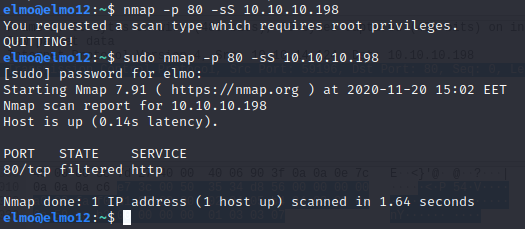
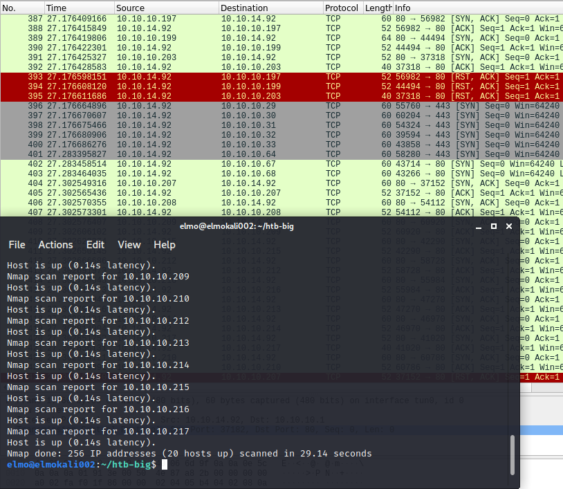
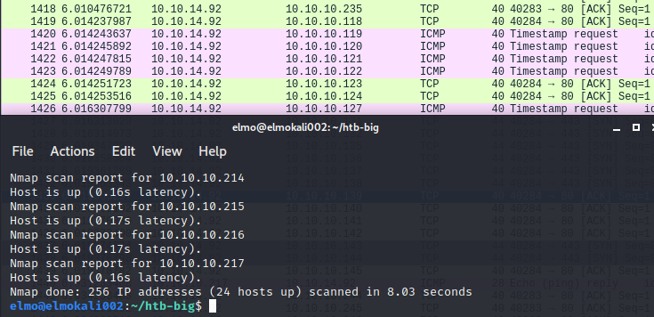
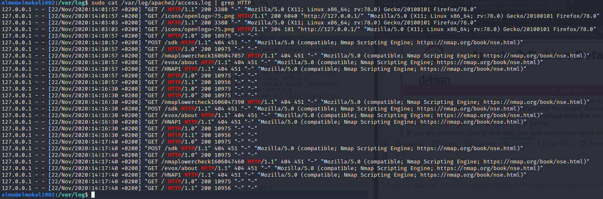

# Harjoitus 3

Harjoituksessa 3 opetellaan käyttämään **nmap**-porttiskanneria, tulkitsemaan sen toimintaa **snifferin** avulla ja tarkastelemaan sen moninaisia toiminnalisuuksia. [Linkki tehtävänantoon](http://terokarvinen.com/2020/tunkeutumistestaus-kurssi-pentest-course-ict4tn027-3006-autumn-2020/#h3). Tehtävän tekoon käytän jo aiemmin asentamaan **Linux Kali**-virtuaalikonetta.

## Lukuläksyt (kohta z)

_Lue artikkelit ja katso videot, tee kustakin muistiinpanot (muutama ranskalainen viiva per artikkeli/video). Tässä z-kohdassa ei tarvitse tehdä mitään kokeita koneella._

### Santos et al: The Art of Hacking - Active Reconnaissance

### 4.1 ja 4.2

  * Aktiivinen tiedustelu eroaa passiivisesta tiedustelusta sillä, että hyökkääjä/tunkeutuja/testaaja pyrkii aktiivisesti eri keinoin ja työkaluin hankkimaan tietoa uhrista/kohteesta ja/tai tämän tietoverkoista.
  * Kohteiden tiedustelussa on tärkeää laittaa muistiin tiedot tiedustelluista kohteista
  * Aktiivisen tiedustelun vaiheita ovat mm. porttiskannaus, webbipalveluiden silmäily, sekä haavoittuvuuksien kartoitus.

### 4.3

**Porttiskannaus**

  * Työkaluista tärkeimmät porttiskannauksessa ovat **nmap** yleistä porttiskannausta ja version nuuhkintaa varten, **masscan** suuria porttimääriä skannatessa, sekä **udpprotoscanner** UDP-skannauksia varten.
  * **nmap**ia käytettäessä voidaan parilla parametrilla saada ohjelma ajettua niin, että kohdejärjestelmästä saadaan esiin mm. avoimet, suljetut, sekä suodatetut portit, ja yleistä tietoa järjestelmästä (käyttöjärjestelmä, palveluiden versiot).
  * **masscan**illä voidaan saavuttaa huimia skannausnopeuksia, mm. koko internetin skannaus yhtä porttia varten kestää n. 3 minuuttia _(ainakin masscanin manuaalin mukaan)_
  * **udpprotoscanner**illa tietojärjestelmiä voidaan skannata UDP-palveluiden varalta.

**Webbipalveluiden silmäily**

  * **EyeWitness** soveltuu hyvin mahdollisten webbipalveluiden silmäilyyn, sekä tarkasteluun teknisestä näkökulmasta.
  * Ajettaessa ohjelma käy läpi kohdejärjestelmästä mahdollisesti löytyvät webbipalvelut, ottaa niistä kuvankaappaukset, listaa yleistä tietoa, sekä tarjoaa käyttäjälle mahdollisia haavoittuvuuksia, mitä hyödyntää jälkeenpäin.

**Haavoittuvuuksien kartoitus**

  * Voidaan etsiä verkon haavoittuvuuksia, sekä webbipalveluiden haavoittuvuuksia.
  * Tietoverkon haavoittuvuuksien kartoituksiin käy mm. ohjelmat **OpenVAS**, **Nessus**, sekä **nmap**, mutta vain rajoitetusti.
  * Webbipalveluiden haavoittuvuuksien kartoituksiin käy mm. **Nikto**, **WPScan**, sekä **SQLMap**
  * Esimerkiksi **nmap**illa haavoittuvuuksien kartoitus tapahtuu ohjelmaan sisäänrakennetun _script engine_n avulla.

### Nmap Network Scanning -  Chapter 1. Getting Started with Nmap

Gordon Lyon, **nmap**in ohjelmoija, sekä siitä kirjan kirjoittanut häkkeri/henkilö avaa nettisivuillaan hyvin **nmap**in toiminnallisuutta. Tehtävän materiaali on kirjan luvusta yksi, jossa otetaan yleissilmäys **nmap**in

Ensimmäisessä esimerkkitapauksessa oletettavasti fiktiivinen Felix on saanut toimeksiannon **Avatar Onlinelta** ja hänen tulisi haavoittuvuuksien kartoitusta palomuurin ulkopuolelta. Tapauksessa on pyritty kuvaamaan tapahtumia realistisesti alkutekijöistä asti, kun Felix varmistaa saaneensa oikean tietoverkon tiedot siihen asti, että hän on löytänyt useita haavoittuvaisuuksia **Avatar Onlinen** verkosta.

Tapauksen yhteydessä käydään läpi **nmap**in käyttöä, sekä muutamia ohjelman parametrejä:

  * **-p-** skannaa kaikki portit 1-65535, vakiona **nmap** skannaa vain 1000 "suosituinta" porttia.
  * **-sS** on TCP-porttien SYN skannaus. Skannaus ei avaa kokonaista TCP-yhteyttä kohteeseen.
  * **-A** ajaa muutamat **nmap**in agressiivisemmat komennot, joilla voidaan mm. tiedustella kohteiden käyttöjärjestelmiä.

Luvun toisessa kohdassa käsitellään oikeasti fiktiivistä tapahtumaa, joka on tapahtunut joissakin **Matrix**-elokuvista, kun elokuvan hahmmo **Trinity** pyrkii kaatamaan sähköverkkoja. Hauska huomata, että elokuvassa, jossa näytetään häkkeröintiä, se on jopa ainakin jollain tasolla teknisesti todenmukainen.

Ajamalla komennon

    nmap -v -sS -O 10.2.1.3

**Trinity** ajaa TCP SYN skannauksen, sekä tiedustelee kohteen käyttöjärjestelmää. Seuraavaksi hän käyttää tunnettua haavoittuvuutta kohdejärjestelmän SSH-palvelussa.

Luvun viimeisessä kohdassa käsiteltiin oikeaa tapausta, jonka seurauksena luvussa seurattu **Lee 'MadHat' Heath** sovelti **nmap**ia omassa työssään sillä seurauksella, että päätyi kirjoittamaan muutamat toiminnallisuudet **nmap**in päälle. Kyseiset skriptit ovat löydettävissä [täältä.](http://www.unspecific.com/nmap/)

**Lee**n ongelma oli, että hänen yrityksensä ylläpiti mittavaa tietokoneiden verkostoa ja sen skannaamiseen kuluva aika oli yli 30 tuntia. Tästä johtuen **Lee** kirjoitti skriptin, joka ajaisi useamman **nmap**-prosessin rinnakkain.

## nmapin käyttö (kohta a ja b)

_Miten nmap toimii? Tee nmapilla seuraavat testit, sieppaa liikenne snifferillä (wireshark) ja analysoi tulokset. Tee testit mahdollisimman suppeasti, jotta analysointi on helpompaa._

Kokeiltavat komennot:

  * TCP connect scan -sT
  * TCP SYN "used to be stealth" scan, -sS
  * ping sweep -sn
  * don't ping -Pn
  * version detection -sV
  * porttien valinta -p1-100, --top-ports 5
  * ip-osoitteiden valinta, verkkomaskilla 10.10.10.0/24, alku- ja loppuosoitteella 10.10.10.100-130
  * output files -oA foo
  * OS fingerprinting, version detection, scripts, traceroute -A
  * ajonaikaiset toiminnot (man nmap: runtime interaction): verbosity v/V, help ?, packet tracing p/P, status s (ja moni muu nappi)
  * normaalisti 'sudo nmap'. Miten nmap toiminta eroaa, jos sitä ajaa ilman sudoa? Suorita ja analysoi esimerkki.
  * vertaile -sV vs -A kestoa (ja lähetetyn datan määrää jos osaat; time, nethogs, wireshark)

Tässä kohdassa kokeillaan **nmapin** eri toimintoja, sekä analysoidaan niiden toimintaa. Aion kokeilla komentoja [**HackTheBoxin**](https://www.hackthebox.eu/) maaliverkkoon. **HackTheBoxin** koneet sijaitsevat IP-välillä 10.10.10.1-10.10.10.254.

Valitsin harjoitusmaaliksi **HackTheBoxin** koneen **Buff**, jonka pyrkisin korkkaamaan tämän harjoituksen aikana. Kokeilin ensiksi yhteyttä **HackTheBoxin** verkkoon pingaamalla kohdekonetta nimeltä **Buff**.

    $ ping 10.10.10.198

Pingaus ei onnistunut, koska en ollut avannut yhteyttä **HackTheBoxin** verkkoon **OpenVPN**:n avulla. Ohjelma ilmoittaa onnistumisesta.

    $ sudo openvpn TheElmo.ovpn

Kokeilin yhdistämisen jälkeen pingausta uudella komentokehotteella ja tällä kertaa homma pelitti.

Avasin seuraavaksi **wiresharkin** taustalle seuraamaan liikennettä. Katsoin toimiiko **wireshark** pingaamalla uudestaan kohdekonetta.

_**Kommentti**: Olin vahingossa tarkastellut KAIKKEA verkkoliikennettä ja wireshark paljasti muutamia IP-osoitteita, jotka nyt eivät sinänsä kriittisiä, mutta en viitsisi laittaa niitä julkisesti internettiin. Pidän alemman kirjoituksen alkuperäisessä kirjoitusasussaan olettaen, että alla olisi kuva kyseisestä verkkoliikenteestä. Harjoituksessa vähän alempana on kuitenkin nähtävissä kuva, jossa näkyvät kohteelle menevät pingit._

_tässä oli aiemmin kuva wiresharkin liikenteesä_

Pingi-paketit näkyvät, joten oletan homman toimivan. Tämän päättelin **wiresharkissa** siitä, että kohteelta **10.10.14.133** lähtee **"Echo (ping) request"** paketti käyttäen **ICMP**-protokollaa osoitteeseen **10.10.10.198**. Pyyntöihin tulee myös kohdekoneelta vastaus **"Echo (ping) reply"**. Komennolla

    $ ip a

näen, että tuo **10.10.14.133** on oman koneeni IP-osoite, joka toimii verkkolaitteessa **tun0**.

### TCP connect scan -sT, --top-ports, -p, don't ping -Pn

Yhteydet ja ohjelmat näyttävät pelittävän oikein. Seuraavaksi olisikin aika kokeilla itse **nmap**ia kohdekoneen porttiskannaukseen.

    TCP connect scan -sT

[nmapin ohjekirjasen mukaan](https://nmap.org/book/man-port-scanning-techniques.html) **nmap -sT** pyrkii yhdistämään kohdejärjestelmään sen sijaan, että lähettäisin pelkän **SYN**-paketin (**nmap -sS**) tarkastellakseen vastausta. Ajoin komennon

    $ nmap --top-ports 50 -sT 10.10.10.198

Tein siis **TCP connect** skannauksen 50:een suosituimpaan porttiin parametrillä **--top-ports 50**, IP:seen 10.10.10.198. En saanut mitään vastaukseksi itse skannaukseen, sillä **nmap** ilmoitti kohteen olevan **"down"** ja suositteli ajamaan komennon parametrin **-Pn** kanssa, jolloin skannatessa, jos kone ei anna vastausta, **nmap** jatkaa silti skannausta. [Lueskelin täältä](https://security.stackexchange.com/questions/31854/what-does-pn-option-mean-in-nmap) ja katsoin myös **nmapin** man-sivuilta.

Ennen komennon uudelleenajoa voisin kuitenkin vilkaista **wiresharkiin** jäänyttä liikennettä. Käynnistin **wiresharkin**
 uudestaan, koska virtuaalikoneeni oli jähmettynyt. Tällä kertaa päätin lukea **wiresharkilla** pelkästään verkkolaitteen **tun0** liikennettä, sillä sen kautta liikenne kulkisi **HackTheBoxin** ja oman koneeni välillä, eikä liikenteessä näkyisi myös kaikkea muuta koneella liikkuvaa. Ajoin uudelleen komennon

    $ nmap --top-ports 50 -sT 10.10.10.198

**Wiresharkin** tulosteesta näkyy, että koneeni on yrittänyt kahteen otteeseen lähettää **SYN**-pakettia IP-osoitteeseen 10.10.10.198 portteihin 80 ja 443, mutta kohde ei ole vastannut mitään. Luulen, että jos kohde olisi reagoinut olisin saanut takaisin **SYN/ACK**-paketin jos kohde olisi valmis muodostamaan yhteyden tai **RST**-paketin, jos kohde haluaisi kertoa meille, että ei halua muodostaa yhteyttä. Se, että kohde ei vastaa voi johtua siitä, että palomuurin asetuksissa on estetty kyseisiin portteihin yhteyden muodostaminen.

Seuraavaksi ajoin **nmap**in pelkästään kohteen porttiin 80, mutta tällä kertaa **-Pn**:n kera. Määritin myös portin parametrilla **-p 80**.

    $ nmap -p 80 -Pn -sT 10.10.10.198

Ajoin komennon kaksi kertaa, ja molemmilla kerroilla koneeni yritti kaksi kertaa lähettää **SYN**-pakettia porttiin 80 IP-osoitteeseen **10.10.10.198**. **-Pn**-parametrilla ajettuna **nmap** tällä kertaa kertoo meille, että portti 80 on **filtered**-tilassa, eli **nmap** ei osaa sanoa, onko portti auki, sillä sen lähettämä kutsu ei koskaan päässyt perille [(nmap - Port Scanning Basics)](https://nmap.org/book/man-port-scanning-basics.html).

### TCP SYN scan, -sV, -oA

Seuraavaksi yritin kokeilla **TCP SYN** skannausta ajamalla komennon

    $ nmap -p 80 -sS 10.10.10.198

mutta sain vastaukseksi, että yritin ajaa skannauksen, joka vaatii root-oikeuksia. Ajoin edellisen uudestaan, mutta sudon kera.

    $ sudo nmap -p 80 -sS 10.10.10.198

Seuraavaksi katsoittaisiin mitä jäi **wiresharkin** haaviin.

_KOMMENTTI: Tässä kohti otin pidemmän tauon tehtävän teossa ja sillä välillä kone **Buff** on siirtynyt vanhentuneisiin koneisiin **HackTheBoxissa**, joten jouduin valitsemaan uuden koneen. Uuden koneen nimi on **Time**. Koneen IP-osoite on 10.10.10.214. Otin yhteyden uudestaan **HackTheBoxin** verkkoon samalla tapaa, kuin aikaisemminkin **openvpn**:n avulla ja kokeilin pingauksilla kohdekoneeseen, olinko vai enkö ollut verkossa._

Ajoin komennon

    $ sudo nmap -p 80 -sS 10.10.10.214

katsoakseni, mitä **wiresharkin** haaviin jäisi uuden koneen porttiskannauksesta. **Nmap** ilmoittaa portin **80** olevan auki. Tämä näkyy konkreettisesti myös **wiresharkiin** jääneestä liikenteestä, sillä kohdekone vastaa lähettämäämme **SYN**-kättelyyn **SYN/ACK**:lla, eli kohdekone on valmis muodostamaan yhteyden. **TCP SYN**-skannauksessa emme kuitenkaan muodosta kokonaista yhteyttä, joten meidän koneemme ei vastaa kohdekoneen **SYN/ACK**:iin.

Koneelta on myös lähtenyt kohteeseen pari **PING**-pakettia skannauksen yhteydessä, sekä omituisesti **SYN**-paketti porttiin **443** ja **ACK**-paketti porttiin **80** skannauksen alussa. En ole täysin varma miksi ohjelma on tehnyt näin.

Seuraavaksi kokeilin tarkastaa portissa **80** pyörivän ohjelman nimen ja version. Oletan, että jonkinnäköinen webbi-palvelin siellä olisi päällä. Ajoin komennon

    $ sudo nmap -p 80 -sS -sV 10.10.10.214

ja sain vastaukseksi, että portissa **80** tosiaan pyörii **Apache 2.4.41** webbipalvelin, tarkemmin ottaen vielä **Ubuntulla** pyörivä versio. Katsoessani **wiresharkin** lokia liikennettä näkyy hurjasti enemmän, kun **nmap** on ajettu **-sV**:n kera. Huomasin myös, että koneeni ottaa jossain vaiheessa kokonaisen yhteyden kohdekoneen porttiin **80**, sillä lokista paljastuu kokonainen **SYN, SYN/ACK, ACK**-kättely koneiden välillä.

Halusin ottaa talteen juuri suorittamani porttiskannauksen tulokset, joten ajoin komennon

    $ sudo nmap -p 80 -sS -sV -oA test 10.10.10.214

jolloin ohjelmanajon tulokset kirjoittuisivat tiedostoihin. **-oA**-parametri määrittää, että **nmap** tulostaa tuloksensa kaikilla saatavilla olevilla formaateilla. Olin luonut kansion **time-box**, jonne tulostin skannauksen tulokset.

### OS fingerprinting, version detection, scripts, traceroute -A, -sV vs -A

Seuraavaksi päätin kokeilla ajaa **nmapia** **-A**-parametrillä.

    $ sudo nmap -p 80 -sS -A 10.10.10.214

Otin parametrin **-sV** pois, sillä **-A** sisältää myös versiontunnistuksen. Kyseisellä parametrillä ajettaessa **nmap** ajaa useampaa toimintoa kohdekonetta vastaan. Skannauksen suorituttua **nmapin** tulosteesta näkyy, että kohdekoneesta ollaan saatu ulos arvaus kohdekoneen käyttöjärjestelmästä, tieto avoimesta portista **80**, sekä nimi ja versio siellä palvelusta (Apache). **nmap** on myös **traceroutannut** liikenteen ja näemme, että kohdekone on kahden hypyn päässä koneestamme. Näemme myös **wiresharkin** tulosteesta, että koko skannaus on suoritettu n. 14 sekunnissa, paketteja on tullut ja mennyt n. 600 kappaletta.

Ajoin komennon

    $ sudo nmap -p 80 -sS -sV 10.10.10.214

ja vertasin skannauksen kestoa, sekä datan määrää edelliseen **-A**:lla ajettuun skannaukseen. Skannaus kestää n. puolet (7,87 sekuntia) edellisestä skannauksesta ja pakettiliikenne on huomattavasti pienempi. **-sV** tosin tulostaa vain skannatun palvelun ohjelmaversion, eikä esimerkiksi suorita **traceroutea**.

### ping sweep -sn, ip-osoitteiden valinta

Seuraavaksi päätin tiedustella koko **HackTheBoxin** verkkoa. Loin aluksi uuden kansion **htb-bix** mahdollisia tulosteiden tallennuksia ja muita erinäköisiä tiedostoja varten. Veikkasin, että kun skannataan kokonainen verkko, niin tulostetta saattaa syntyä pitkät pätkät. Ajoin komennon

    $ sudo nmap -p 80 -sS 10.10.10.0/24

jolloin kyseessä olisi **TCP SYN**-skannaus porttiin **80**. Päätin valita **IP-osoitteet** antamalla verkon verkkomaskin, samalla tapaa kuin miten **HackTheBoxin** sivuilla on osoitteet annettu. [**Ipcalcilla**](http://jodies.de/ipcalc) tarkasteltuna tämä tarkoittaisi, että kaikki koneet **IP-välillä 10.10.10.1-10.10.10.254** skannattaisiin.

Ajoin komennon uudestaan, mutta päätin ottaa **grepable outputin** parametrillä **-oG**

    $ sudo nmap -p 80 -sS -oG htb-all 10.10.10.0/24

Koska tavaraa oli niin paljon, on hyvä ottaa tieto talteen jonnekkin, ettei koko verkkkoa joutuisi aina skannaamaan uudestaan portin **80** varalta.

Seuraavaksi kokeilin **ping sweepiä** koko **HTB:n** verkkoon.

    $ nmap -sn 10.10.10.0/24

Kuten [nmapin sivuilla lukee](https://nmap.org/book/man-host-discovery.html), ajettuna ilman **sudoa**, kohdeverkkoon lähetetään vain **SYN**-paketteja portteihin **80** ja **443**. **nmap** antaa tiedoksi, mitkä kohdeverkossa olevat koneet ovat päällä.

_kuvankaappauksessa näkyy **nmapin** tuloste, sekä **wiresharkin** kaappaamaa liikennettä. Nähtävissä on **SYN**-paketit kohteisiin, portteihin **80**, sekä **443** ja muutamia kohteiden vastauksia (**SYN/ACK**)_

Ajeattaessa **sudon** kanssa **nmap** lähettää myös **ACK**-paketteja.

## kohta c, Ninjojen tapaan. Aja nmap-versioskannaus -sV omaan paikalliseen weppipalvelimeen

Tehtävää varten aloitin **wiresharkilla** kuuntelun **loopback**-verkkolaitteessa, sillä tulisin tarkkailemaan paikallisesti ajettua palvelua, enkä tarvinnut tietoa muiden verkkolaitteiden liikenteesä.

Lopetin mahdollisesti taustalla pyörivät **nginx** ja **apache2** palvelut ja käynnistin **apache2**:n uudestaan. Avasin selaimella osoitteen **127.0.0.1** (localhost olisi myös käynyt). **Apache** avautuu vakiona porttiin **80**, johon myös selaimet ohjaavat vakiona, jos porttia ei ole erikseen määritetty.

    $ sudo service apache2 stop
    $ sudo service nginx stop
    $ sudo service apache2 start

**wiresharkissa** näkyy myös, että koneemme on avannut onnistuneesti yhteyden verkkopalveluun (**SYN/ACK**-kättely onnistuneesti, sekä tämän jälkeen **GET**-pyyntö, jolla haetaan sivun sisältö).

Seuraavaksi ajoin porttiskannauksen porttiin **80** omalle koneelleni versiontarkistusparametrillä **-sV**.

    $ nmap -p 80 -sV 127.0.0.1

Tulokseksi sain, että portti **80** on auki ja siellä pyörii **Apachen** versio 2.4.46. **wiresharkiin** jäänyt liikenne vaikuttaa hyvin samanlaiselta, kuin mitä aikaisemmissakin **-sV**-skannauksissa.

**wiresharkiin** jääneestä liikenteestä voi huomioida (kun suodattaa vain **HTTP**-pyynnöt), että **nmap** tekee jotain urkintaa, lähettämällä **GET**-pyyntöjä, joihin palvelu mm. vastaa kertomalla versionumeronsa.

Katsoin myös, olisiko **Apachen** access.logiin jäänyt jotain skannauksestani. Veikkaisin, että olisi, sillä lähettihän skannaus **GET**-pyyntöjä palvelimelle. Käytin komentoa

    $ sudo cat /var/log/apache/access.log | grep HTTP

_access.login sijainnin minulle paljasti [tämä sivusto.](https://blog.codeasite.com/how-do-i-find-apache-http-server-log-files/)_

ja tulosteesta näkyi, että jotain pyyntöjä on tullut joissa näkyy selkeästi **nmap** mainittuna. **nmap** yrittää vissiin joillakin **POST**-pyynnöillä urkkia jotain **Scripting Enginensä** avulla.

Tämä hälyttää varmasti, mutta vain sillon, jos liikennettä palvelimelle on vähän ja joku jaksaa tarkistaa lokeja, joko manuaalisesti tai automaattisesti.

## Kohta d, UDP-skannaus

  * Mitkä ovat tavallisimmat tai kiinnostavimmat palvelut, joita UDP-skannauksella voisi löytää?

[**Tämä sivu**](https://nmap.org/book/scan-methods-udp-scan.html) toimi lähteenä. Kolme tavallisinta **UDP**-palvelua, mitä palvelimilta voi löytyä ovat **DNS** (Domain Name System [- Wikipedia.](https://fi.wikipedia.org/wiki/DNS)), **SNMP** (Simple Network Management Protocol [- Wikipedia.](https://fi.wikipedia.org/wiki/SNMP)), sekä **DHCP** (Dynamic Host Configuration Protocol [- Wikipedia.](https://fi.wikipedia.org/wiki/DHCP))

  * Miksi UDP-skannaus on hankalaa ja epäluotettavaa?

[**Tämä sivu**](https://nmap.org/book/scan-methods-udp-scan.html) toimi lähteenä. **UDP**-skannauksen yhtenä vaikeutena on mm. se, että avoimet portit eivät välttämättä vastaa lähetettyihin pyyntöihin. Tällöin **nmapin** on vaikea päätellä onko portissa pyörimässä jokin palvelu, joka ei vain vastaa, vai onko kyseessä suodattavan palomuurin asetukset, jotka estävät pakettien perillä pääsyä.

**UDP**-paketteihin ei myöskään saata tulla vastausta sen takia, että jokain **UDP**-palvelu määrittää pakettirakenteensa eri tavalla. **nmapissa** kuitenkin on keinoja lähettää yksittäisille palveluille tarkoitettuja paketteja.

  * Miksi UDP-skannauksen kanssa kannattaa käyttää --reason flagia?

[**Tämä sivu**](https://geek-university.com/nmap/the-reason-flag/) toimi lähteenä. Koska **UDP**-skannauksessa on välillä vaikea sanoa, onko portti oikeasti auki ja sieltä ei kuulu vastausta, vai on palomuuri pudottamassa ei-toivotut paketit, kannattaa **UDP**-skannaus ajaa **--reason**-flagin kera. Käytettäessä **--reason**-flagia **nmap** ilmoittaa onko portti missä tilassa ja miksi se niin päättelee. Testasin nopeasti ajamalla kohdekoneeseen **10.10.10.214** komennon

    $ sudo nmap --top-ports 25 -sU --reason 10.10.10.214

, eli 25 suosituimpaan porttiin **UDP**-skannaus, sekä selitykset perään. Kuvankaappauksessa näkyy porttien tila, sekä **nmapin** päätelmä, miksi ne ovat siinä tilassa missä ovat.

Portit ovat merkitty **closed**, sillä **nmap** ei saanut paketteja perille.

  * Vapaaehtoinen bonuskohta: näytä esimerkki onnistuneesta UDP-skannauksesta, sekä jonkin UDP:n erityisominaisuuden takia epäonnistuneesta tai harhaanjohtavan tuloksen antavasta UDP-skannauksesta.

## Lähteet

1. [Tero Karvinen](http://terokarvinen.com/2020/tunkeutumistestaus-kurssi-pentest-course-ict4tn027-3006-autumn-2020/#h3)
2. [O'Reilly - Santos et al](https://learning.oreilly.com/videos/the-art-of/9780135767849/9780135767849-SPTT_04_00)
3. [nmap - Gordon Lyon](https://nmap.org/book/nmap-overview-and-demos.html)
4. [HackTheBox](https://www.hackthebox.eu/)
5. [StackExchange - What does -Pn option mean in nmap?](https://security.stackexchange.com/questions/31854/what-does-pn-option-mean-in-nmap)
6. [Wikipedia - ICMP](https://fi.wikipedia.org/wiki/ICMP)
7. [Wikipedia - TCP](https://fi.wikipedia.org/wiki/TCP)
8. [nmap - Port Scanning Basics]()
9. [codeasite - apachen lokit](https://blog.codeasite.com/how-do-i-find-apache-http-server-log-files/)
10. [Wikipedia - DNS](https://fi.wikipedia.org/wiki/DNS)
11. [Wikipedia - SNMP](https://fi.wikipedia.org/wiki/SNMP)
12. [Wikipedia - DHCP](https://fi.wikipedia.org/wiki/DHCP)
13. [geekuniversity - nmap reason flag](https://geek-university.com/nmap/the-reason-flag/)

Elmo Rohula 2020