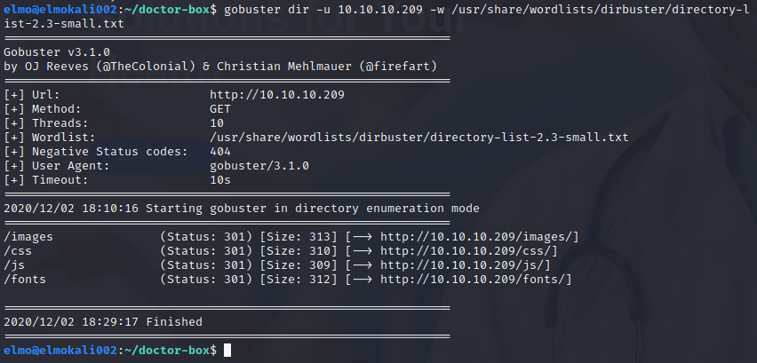

# Harjoitus 4

[tero karvinen](http://terokarvinen.com/2020/tunkeutumistestaus-kurssi-pentest-course-ict4tn027-3006-autumn-2020/)

## Kohta z

Lue artikkelit ja katso videot, tee kustakin muistiinpanot (muutama ranskalainen viiva per artikkeli/video).

### Writeup - IppSec

[Linkki videoon](https://www.youtube.com/watch?v=GKq4cwBfH24)

  * Helpohko kone, CMSMadeSimplessä haavoittuvuus, **SearchSploitilla** haavoittuvuuden tunnistaminen, valmiin hyökkäyksen hyväksikäyttö ja tulokseksi saadun suolatun MD5-hashin murto **hashcatillä**, jolla saadaan käyttäjätunnukset. 
  * Aktiivisen tiedustelun aikana **nmapista** paljastuu portissa **80** pyörivä webbipalvelu, sekä **robots.txt**-tiedosto, joka kertoo hakukoneille, että sivua **koneen-ip/writeup** ei tulisi indeksoida. **writeup**-sivulta huomataan, että sivu on generoitu **CMSMadeSimplellä**. **SearchSploitilla** **CMSMS**:stä löytyi useita valmiita haavoittuvuuksia.
  * **SQL-injektio** haavoittuvuus käytiin läpi **BurpSuiten** avulla. Injektiolla saatiin eräs sähköposti, salakirjoitettu salasana, sekä salasanan suola. Salasana kräkättiin **hashcatillä**.
  * Kun käyttäjä oli korkattu, kohdekone enumeroitiin **LinEnumilla** sen jälkeen kun **SSH**-yhteys oltiin avattu.

### Heist - IppSec

[Linkki videoon](https://www.youtube.com/watch?v=fmBb6BgLsC8)

  * Aktiivisessa tiedustelussa paljastui, että kohdekoneessa on auki portti **80**, jossa pyörii **Microsoft IIS**. Kohdekone vaikuttaa myös olevan **Windows Server**. Myös portit **135**, sekä **445** olivat auki.
  * Kohdekoneen webbipalvelusta löytyi kirjautumissivu, jonne pystyi kirjautumaan mnyös vieraana. Vieraana kirjauduttaessa näkyi sivulal aikaisemmin käyty keskustelu, sekä liitteenä oleva tiedosto. Nämä sisälsivät jonkin **Cisco**-laitteen konfiguraatiot ja pari salasanaa. Salasanat murtuivat helposti valmiin **Python**-skriptin avulla.
  * **crackmapexec** käyttäjien, sekä salasanojen enumerointiin.
  * **mfsdb**, **procdump64.exe**

[0xdf - HTB Adminer](https://0xdf.gitlab.io/2020/09/26/htb-admirer.html)
[0xdf - HTB Frolic](https://0xdf.gitlab.io/2019/03/23/htb-frolic.html)

## kohta a, Etsi ja kokeile 5 uutta työkalua jostain lukemastasi/katsomastasi läpikävelystä.

### gobuster

Aloitin tiedustelemalla **Doctor**-nimisen koneen **HackTheBoxin** verkosta **nmapilla**.

  $ sudo nmap 10.10.10.209 -sT -sV -sC -oA doctor

Koneesta paljastui **Apache** pyörimässä portissa **80**, **SSH** portissa **22**, sekä jokin **splunkd** niminen demoni portissa **8089**. Samasta portista tulee myös ilmoitus **robots.txt**-tiedoston olemassaolosta, joka viittaisi siihen, että hakukoneiden indeksoinnilta halutaan estää jokin sivusto.

Lähdin ajamaan **gobusteria** aluksi **rockyou.txt**-sanakirjalla, mutta tajusin sen kestävän ikusuuksia, joten tarkistin sanalistat uudestaan ja ajoin komennon uudestaan **dirbusterin** sanakirjalla. Käytin myös **-r**-lippua, jolloin **gobuster** ei jatkaa crawlausta redirectin vastaan tullessa.

  $ gobuster dir -u 10.10.10.209 -w /usr/share/wordlists/rockyou.txt 

  $ gobuster dir -r -u 10.10.10.209 -w /usr/share/wordlists/dirbuster/directory-list-2.3-medium.txt 

Medium-sanalistakin oli suhteellisen pitkä, joten ajoin uudestaan pienemmällä sanalistalla

  $ gobuster dir -u 10.10.10.209 -w /usr/share/wordlists/dirbuster/directory-list-2.3-small.txt

Tulokseksi en saanut valitettavasti mitään jännittävää. Lähinnä perus html, js, images, sekä fonts kansiot löytyivät.

### BurpSuite

BurpSuite on yleihyödyllinen skannaus- ja monitoimityökalu webbi-pohjaisten haavoittuvuuksien tarkasteluun ja hyödyntämiseen.

Asetin **Firefoxissa** proxyn localhostiin, porttiin 8080, josta nappaisin pyyntöjä **BurpSuitella**.

Kokeilen kaapata pyyntöjä **HackTheBoxin** **Time**-koneen webbisivulta, sekä muokata niitä ja lähettää eteenpäin manuaalisesti. Käytin webbipalvelimen lomaketta lähettääkseni kokeeksi "Test123" ja katsoisin **BurpSuitesta** pyyntöä.

Pyyntö, sekä syöttämäni teksti osui haaviin. Nyt voisin muokata pyyntöä kuinka näkisin sopivaksi. **BurpSuitella** pystyisi esimerkiksi kokeilemaan helposti **SQL-injektioita**. Laiton pyyntöni data-parametriksi "foobar123" ja lähetin pyynnön.

Sivusto valittaa saaneensa syötteen "foobar123", joten pyynnön kaappaus ja muokkaus onnistui **BurpSuitella**.

### LinEnum

[Linkki ohjelmaan.](https://github.com/rebootuser/LinEnum) **LinEnumilla** voi enumeroida kokonaisen Linux-koneen vaihtelevalla intensiteetillä. Ohjelmalla voi löytää jänniä kansioita, tiedostoja, käyttäjänimiä jne. Hyödyllinen työkalu, jos on saanut käsiinsä jonkin kohdekoneen käyttäjätunnukset ja päässyt kirjautumaan.

Kokeilin komennolla

  $ ./LinEnum.sh -r TestRun -e /tmp/

ja sain pitkän tulosteen. Tuloste ei mahdu ylensä kokonaan terminaalin näytölle, joten se kannattaa ottaa tiedostona talteen. Tulosteesta näkyä mm. komentohistoriani.

Huomioitavan arvoista on se, että komentohistoriasta näkyy - ainakin itsellä - koneen luonnista asti annetut komennot. Tämä voi olla erittäin mehukas tiedonpala, jos haluaa tietää kohdekoneen konffaukset, mahdolliset käyttäjien luonnit jne.

## kohta b, Tiedustele ja analysoi 5 htb konetta perusteellisesti

Aloitin ajamalla **nmapin** **HackTheBoxin** koneisiin 10.10.10.188-254.

  $ sudo nmap -sT -sC -sV --reason 10.10.10.188-254

Tulostetta tuli jonkin verran, koko pätkä löytyy [täältä.](./iso_nmap.txt).

Kone osoitteessa **10.10.10.217**:

  * Portit **22**, **80** ja **443**
  * Oletettavasti Windows-kone versioskannauksen tietojen perusteella (22/tcp .... OpenSSH for_Windows_7.7 (protocol 2.0))
  * Koneen nimi vaikuttaisi olevan **Cereal** (ssl-cert: Subject: commonName=cereal.htb
| Subject Alternative Name: DNS:cereal.htb, DNS:source.cereal.htb)

Kone osoitteessa **10.10.10.218**:

  * NetBSD-kone versioskannauksesta päätellen (OpenSSH 8.0 (NetBSD 20190418-hpn13v14-lpk; ......, Service Info: OS: NetBSD; CPE: cpe:/o:netbsd:netbsd)
  * Portit **22**, **80**, sekä **9001**
  * Jostain **nmapin**-skripteistä löytyi jotain yllättävää: näyttäisi, että koneella on sama **SSH-avain**, kuin parilla muulla skannaamallani koneella (...... | ssh-hostkey: Possible duplicate hosts
| Key 3072 48:ad:d5:b8:3a:9f:bc:be:f7:e8:20:1e:f6:bf:de:ae (RSA) used by:
|   10.10.10.201
|   10.10.10.205
|   10.10.10.212 ......)
  * Portissa **9001** pyörii jokin **Medusa**-niminen palvelu.

Kone osoitteessa **10.10.10.208**:

  * Portit **21**, **22**, sekä **80** auki.
  * Portissa **21** pyörivä **ftp**-palvelu (vsftpd 2.0.8) ei ole uusin versio kyseisestä palvelusta. Tähän voisi etsiä haavoittuvuuksia.
  * Vaikuttaa olevan Linux-kone (Service Info: Host: Cross; OS: Linux)

Kone osoitteessa **10.10.10.201**:
 
  * Portit **22**, **9000**, sekä **9100** auki
  * Kone palautti jostain palvelusta melkoisen mielenkiintoisen möykyn jotain dataa. Näyttää jollain tavalla salakirjoitetulta tai muuten enkoodatulta (....... SF-Port9000-TCP:V=7.91%I=7%D=12/2%Time=5FC7C7F1%P=x86_64-pc-linux-gnu%r(NU
SF:LL,3F,"\0\0\x18\x04\0\0\0\0\0\0\x04\0@\0\0\0\x05\0@\0\0\0\x06\0\0\x20\0
SF:\xfe\x03\0\0\0\x01\0\0\x04\x08\0\0\0\0\0\0\?\0\x01\0\0\x08\x06\0\0\0\0\
SF:0\0\0\0\0\0\0\0\0")%r(GenericLines,3F,"\0\0\x18\x04\0\0\0\0\0\0\x04\0@\
SF:0\0\0\x05\0@\0\0\0\x06 .......)

Kone osoitteessa **10.10.10.200**:

  * Portit **22**, **873**, sekä **3128** auki
  * Portissa **22** OpenSSH ei ole viimeisin versio (OpenSSH 7.9p1 Debian), nopealla Googlauksella löytyi jo mahdollisia haavoittuvuuksia. [Täällä niistä lisää](https://www.cybersecurity-help.cz/vdb/openssh/openssh/7.9p1/)
  * Oletettavasti Linux-kone (Service Info: OS: Linux)

## kohta c, Nimeä 1-3 walktrough:ta, joissa tunkeudutaan samantapaisiin palveluihin, joita käsittelit kohdassa b

# Lähteet

1. [Tero Karvinen](http://terokarvinen.com/2020/tunkeutumistestaus-kurssi-pentest-course-ict4tn027-3006-autumn-2020/)
2. [Youtube - IppSec - Writeup](https://www.youtube.com/watch?v=GKq4cwBfH24)
3. [0xdf - HTB Adminer](https://0xdf.gitlab.io/2020/09/26/htb-admirer.html)
4. [0xdf - HTB Frolic](https://0xdf.gitlab.io/2019/03/23/htb-frolic.html)
5. [cybersecurity](https://www.cybersecurity-help.cz/vdb/openssh/openssh/7.9p1/)
