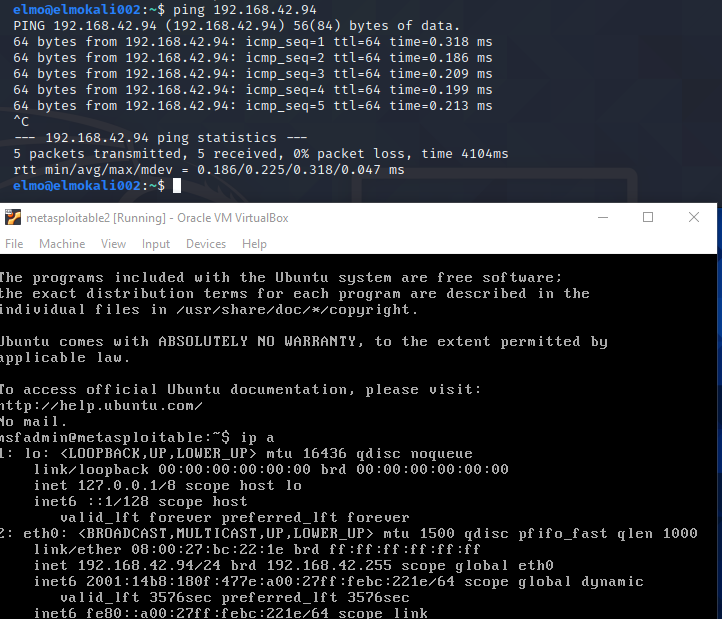
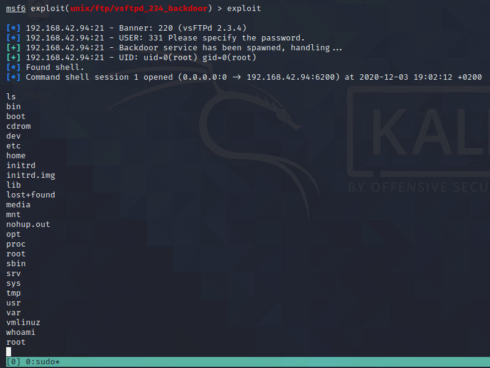

# Harjoitus 5

Tehtävänanto kokonaisuudessaan kohdassa **H5** [Tero Karvisen nettisivuilla](http://terokarvinen.com/2020/tunkeutumistestaus-kurssi-pentest-course-ict4tn027-3006-autumn-2020/).

## Kohta z

Lue artikkelit ja katso videot, tee kustakin muistiinpanot

## Kohta a /// Metasploitable

Asenna Metasploitable 2. Murtaudu sille useilla tavoilla

Latasin **Metasploitable 2** harjoitusmaalin [(Sourceforge)](https://sourceforge.net/projects/metasploitable/), ja asensin sen **Securing Ninjan** ohjeiden [(Securing Ninja)](https://securingninja.com/how-to-install-metasploitable-in-virtualbox/) mukaisesti Virtual Boxille. Käynnistin sen, sekä aikaisemmin luomani **Linux Kalin**. Testiksi pingasin Metasploitablea katsoakseni, että saivat toisiinsa yhteyden.

Avasin seuraavaksi **Kalilla** **msfconsolen** ja tarkistin tietokanta yhteyden

    kali $ db_status

ja ohjelma ilmoitti yhteyden pelittävän. Loin uuden **workspacen** Metasploitable kokeiluja varten, jonne ohjelma tallettaisi kaiken keräämäni tiedon. Katsoin myös, että **workspace** luotiin ja että se olisi valittuna.

    kali $ workspace -a metasp
    kali $ workspace

Seuraavaksi ajoin **db_nmapin** Metasploitablea vastaan. Ohjelma toimii kuten normaali **nmap**, mutta tallettaa tiedot **metasploitin** tietokantaan.

    kali $ db_nmap -sC -sV -sT 192.168.42.94

Tarkistin skannauksen päätyttyä, että tiedot löytyisivät **metasploitista**.

    kali $ hosts
    kali $ services

Silmään pisti portissa **21** pyörivä **vsftpd 2.3.4**. Kyseisessä versiossa on ollut lyhyen aikaa "backdoor" haavoittuvuus [(rapid7)](https://www.rapid7.com/db/modules/exploit/unix/ftp/vsftpd_234_backdoor/). Etsin **metasploitista** hyökkäyksiä juuri tuohon versioon ja sieltä löytyi yksi. Otin sen aktiiviseksi.

    kali $ search vsftpd 2.3
    kali $ use 0

Komennolla "info" saisin lisätietoa hyökkäyksestä. Asetin hyökkäyksen **RHOSTS** arvoksi kohdekoneen IP-osoitteen, jotta se osaisi käyttää sitä oikeaa konetta vastaan.

    kali $ set RHOSTS 192.168.42.94

Seuraavaksi ajoin hyökkäyksen ja sain shellin kohdekoneelle! Kokeilin vielä kohdekoneella ajaa **whoamin** katsoakseni, millä tunnuksella olin päässyt sisään.

    kali $ exploit
    kali (kohdekoneen shell)$ whoami

## Kohta b ja c /// Skannaa HackTheBoxin verkko

**b:** Skannaa HackTheBoxin verkko niin, että tallennat tulokset Metasploitin tietokantoihin.
**c:** Onko joukossa vanhoja tai haavoittuvia versioita.

## Kohta k /// Korkkaa jokin HTB:n kone

# Lähteet

1. [Tero Karvinen](http://terokarvinen.com/2020/tunkeutumistestaus-kurssi-pentest-course-ict4tn027-3006-autumn-2020/)
2. [Sourceforge](https://sourceforge.net/projects/metasploitable/)
3. [Securing Ninja](https://securingninja.com/how-to-install-metasploitable-in-virtualbox/)
4. [rapid7](https://www.rapid7.com/db/modules/exploit/unix/ftp/vsftpd_234_backdoor/)
