# Harjoitus 5

Tehtävänanto kokonaisuudessaan kohdassa **H5** [Tero Karvisen nettisivuilla](http://terokarvinen.com/2020/tunkeutumistestaus-kurssi-pentest-course-ict4tn027-3006-autumn-2020/).

## Kohta z

Lue artikkelit ja katso videot, tee kustakin muistiinpanot

Lähde: [Jaswal 2020: Mastering Metasploit - 4ed](https://www.oreilly.com/library/view/mastering-metasploit-/9781838980078/B15076_01_Final_ASB_ePub.xhtml#_idParaDest-30
)

Metasploitilla on mahdollista suorittaa valmiita hyökkäyksiä tunnettuja haavoittuvuuksia vastaan kohdekoneilla.

  * **Exploits:** suorittaa valitun hyökkäyksen määriteltyä kohdetta tai kohteita vastaan
  * **Payload:** hyökkäykseen valittu hyötykuorma, joka tullaan ajamaan kohdekonetta vastaan ***exploitia** käytettäessä
  * **Auxiliary:** joukko erinäköisiä moduleita auttamaan hyökkäyksessä, sitä ennen, sen aikana tai sen jälkeen
  * **Encoders:** näillä eri moduleita pyritään piilottamaan kohdekoneelta palomuurien tai viruksentorjuntaohjelmistojen ohittamiseksi
  * **Meterpreter:** hyötykuorma, joka kirjoittaa itsensä kohdekoneen muistiin

Lähdeartikkeli esittelee myös useita **metasploitin** peruskomentoja ja niiden toiminnallisuutta.

  * **use:** käytä valitsemaasi hyökkäystä
  * **info:** listaa tiedot haluamastasi modulista tai hyökkäyksestä
  * **set:** asettaa muuttujia hyökkäykselle, jonka pohjalta hyökkäys toimii, esim. kohdekoneen **IP-osoite**, **sanalistat**
  * **search:** hakee **metasploitin** tietokannasta annetuilla hakusanoilla moduleita, hyökkäyksiä tmv.

## Kohta a /// Metasploitable

Asenna Metasploitable 2. Murtaudu sille useilla tavoilla

Latasin **Metasploitable 2** harjoitusmaalin [(Sourceforge)](https://sourceforge.net/projects/metasploitable/), ja asensin sen **Securing Ninjan** ohjeiden [(Securing Ninja)](https://securingninja.com/how-to-install-metasploitable-in-virtualbox/) mukaisesti Virtual Boxille. Käynnistin sen, sekä aikaisemmin luomani **Linux Kalin**. Testiksi pingasin Metasploitablea katsoakseni, että saivat toisiinsa yhteyden.

Avasin seuraavaksi **Kalilla** **msfconsolen** ja tarkistin tietokanta yhteyden

    kali $ db_status

ja ohjelma ilmoitti yhteyden pelittävän. Loin uuden **workspacen** Metasploitable kokeiluja varten, jonne ohjelma tallettaisi kaiken keräämäni tiedon. Katsoin myös, että **workspace** luotiin ja että se olisi valittuna.

    kali $ workspace -a metasp
    kali $ workspace

Seuraavaksi ajoin **db_nmapin** Metasploitablea vastaan. Ohjelma toimii kuten normaali **nmap**, mutta tallettaa tiedot **metasploitin** tietokantaan.

    kali $ db_nmap -sC -sV -sT 192.168.42.94

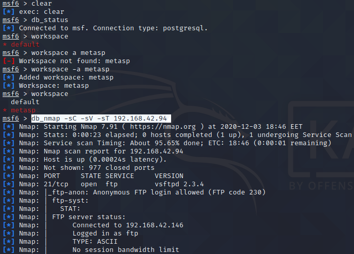

Tarkistin skannauksen päätyttyä, että tiedot löytyisivät **metasploitista**.

    kali $ hosts
    kali $ services

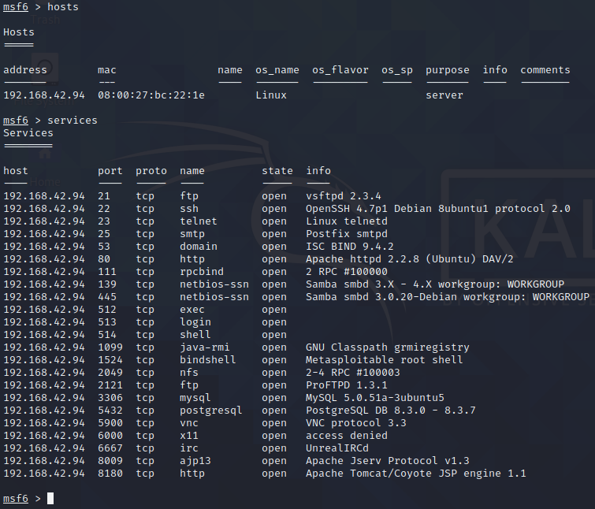

Silmään pisti portissa **21** pyörivä **vsftpd 2.3.4**. Kyseisessä versiossa on ollut lyhyen aikaa "backdoor" haavoittuvuus [(rapid7)](https://www.rapid7.com/db/modules/exploit/unix/ftp/vsftpd_234_backdoor/). Etsin **metasploitista** hyökkäyksiä juuri tuohon versioon ja sieltä löytyi yksi. Otin sen aktiiviseksi.

    kali $ search vsftpd 2.3
    kali $ use 0

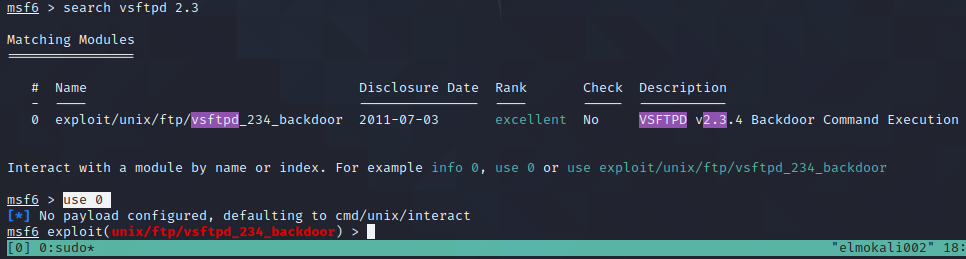

Komennolla "info" saisin lisätietoa hyökkäyksestä. Asetin hyökkäyksen **RHOSTS** arvoksi kohdekoneen IP-osoitteen, jotta se osaisi käyttää sitä oikeaa konetta vastaan.

    kali $ set RHOSTS 192.168.42.94

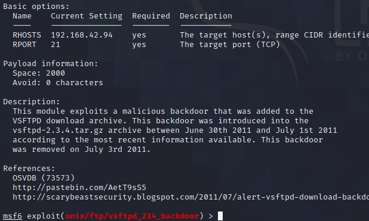

Seuraavaksi ajoin hyökkäyksen ja sain shellin kohdekoneelle! Kokeilin vielä kohdekoneella ajaa **whoamin** katsoakseni, millä tunnuksella olin päässyt sisään.

    kali $ exploit
    kali (kohdekoneen shell)$ whoami

Huomasin myös, että koneella pyörivä **samba** oli vanhempi versio. Katsaisin nopeasti, josko kyseiseen versioon olisi valmiita hyökkäyksiä ja olihan siellä yksi.

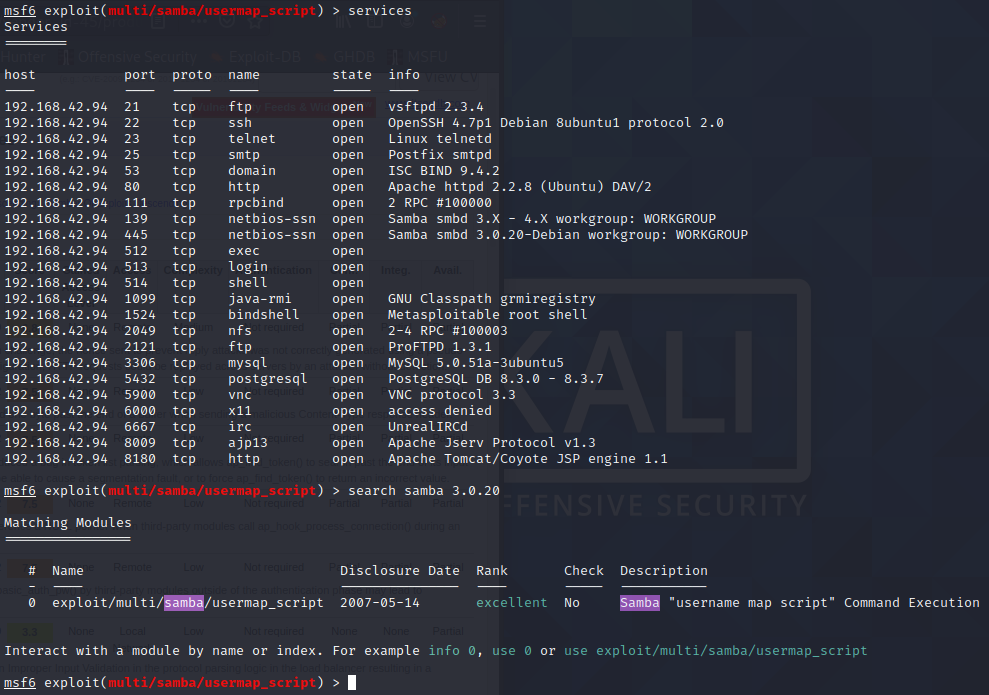

Katsomalla kyseisen hyökkäyksen infoa, saamme tietää, että hyökkäys hyväksikäyttää haavoittuvuutta, jolla pääsemme ajamaan haluamiamme komentoja.

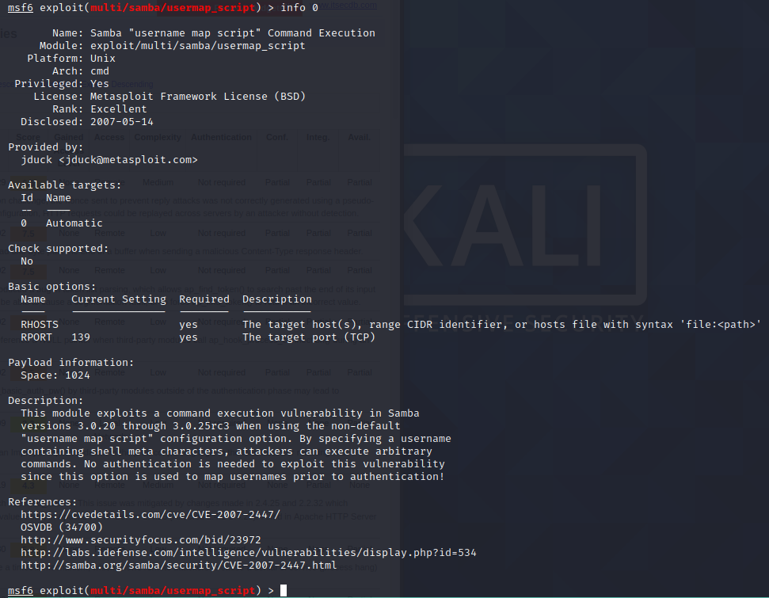

Asetan kohdekoneen **IP-osoitteen** komennolla

    $ set RHOSTS 192.168.42.94

jotta hyökkäys kohdistuu oikein. Muut tiedot olivatkin jo oikein.

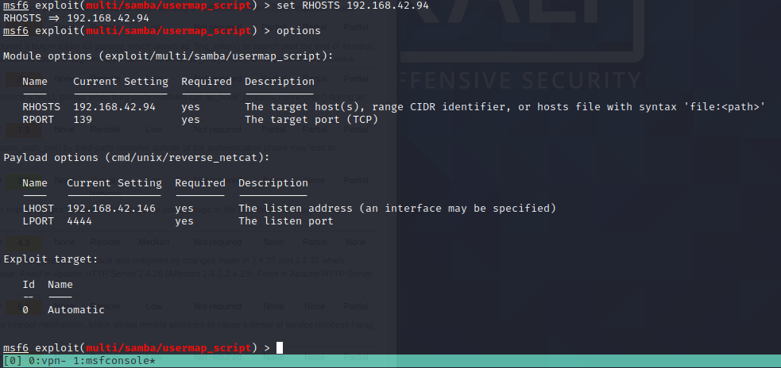

Seuraavaksi käytin hyökkäystä ja pääsin koneeseen sisään! Ajoin vielä **whoami**:n katsoakseni, millä käyttäjällä olin päässyt sisään.

    $ exploit
    (kohdekone)$ whoami

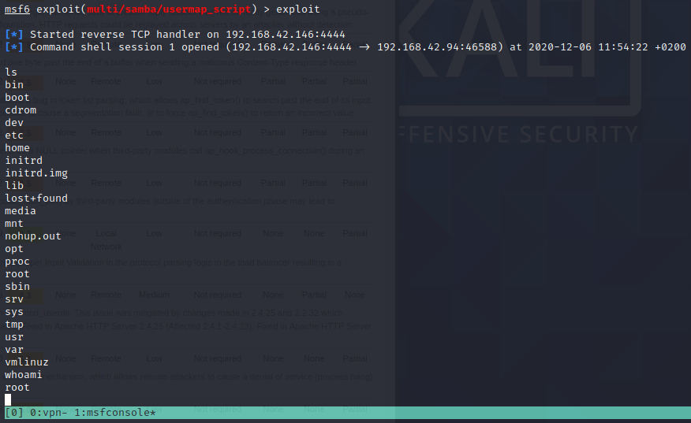

## Kohta b ja c /// Skannaa HackTheBoxin verkko

Aloitin avaamalla **msfconsolen** ja pingasin tunnettua **HackTheBoxin** konetta kokeillakseni yhteyden toimivuutta. Seuraavaksi loin uuden **workspacen**, johon tulisin tallentamaan tiedot tiedustelemistani koneista.

    $ ping 10.10.10.198
    $ workspace -a htb
    $ workspace

Aloitin porttiskannauksen **db_nmapilla** suhteellisen kevyillä parametreillä; versionskannauksella, sekä **nmapin** vakioskripteillä.

    $ db_nmap -sC -sV 10.10.10.0-254

Skannaus kesti hetkisen, mutta valmistui.

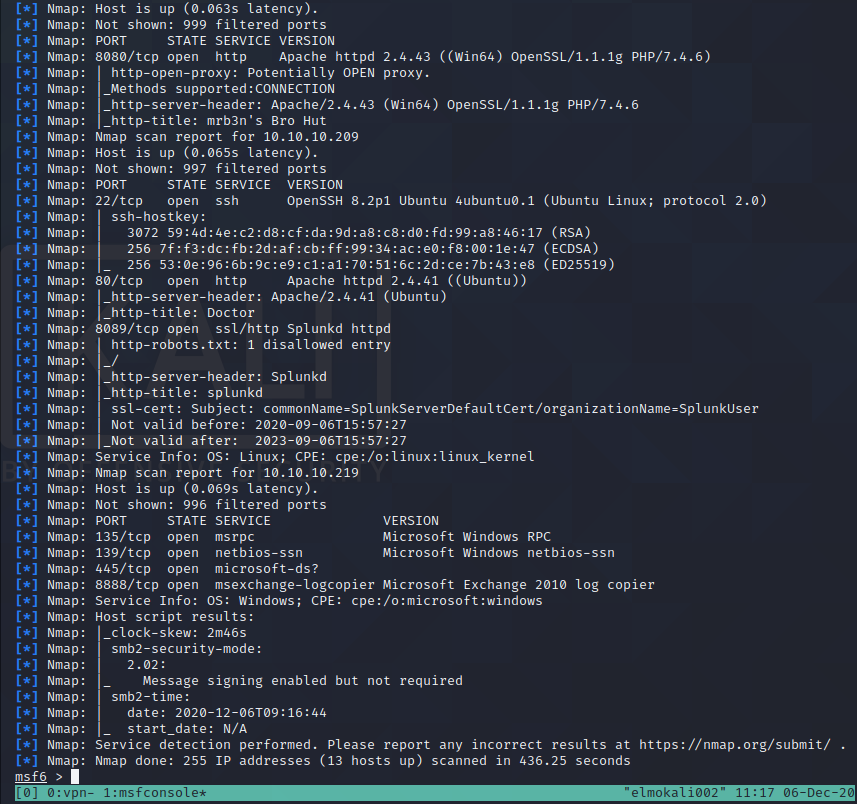

Ajamalla **services** komennon **msfconsolessa** näen nyt kaikki skannatujen kohteiden portit, joista **nmap** löysi jotain. Voin myös suodattaa tuloksia **IP-osoitteen** mukaan ajamalla **services (koneen IP)**.

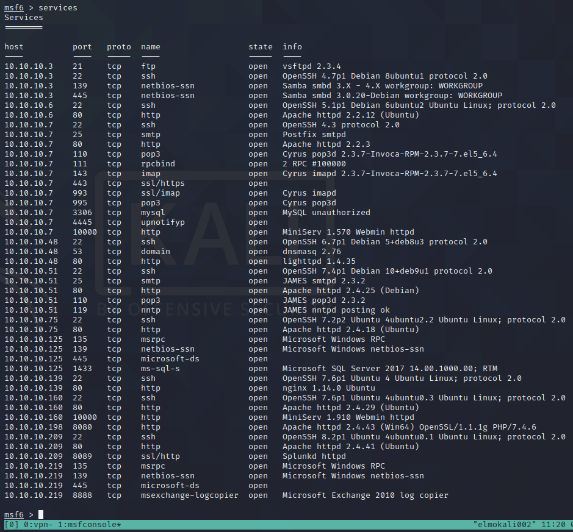

Osaan jo suorilta käsin sanoa, että ainakin koneella, jonka **IP-osoite** on **10.10.10.3** on käynnissä vanha versio **vsftpd**-palvelusta, johon löytyy valmis hyökkäys **metasploitista**. Toki, kyseinen **2.3.4**-versio oli haavoittuvainen vain hetken aikaa. Voin etsiä **metasploitilla** valmista hyökkäystä.

    $ search vsftpd

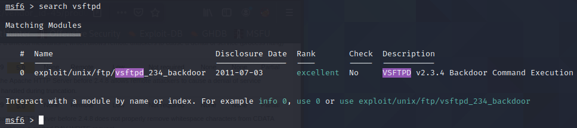

Myös **10.10.10.7** osoitteessa sijaitsevalla koneella on vanha versio **Apachesta** (2.2.3). **Metasploitissa** ei löytynyt juuri tuolle versiolle mitään valmista hyökkäystä, mutta **cvedetails.com** kertoo useammasta haavoittuvuudesta kyseisessä **Apachen** versiossa [(cvedetails)](https://www.cvedetails.com/vulnerability-list/vendor_id-45/product_id-66/version_id-40007/Apache-Http-Server-2.2.3.html)

Katsoin myös kohteen **10.10.10.160** avointen palveluiden joukosta jos sieltä löytyisi jotain jännittävää. Itsellä iski silmään **MiniServ 1.910 Webmin httpd**. Käytin **searchsploitia** etsiäkseni hyökkäyksiä.

    $ services 10.10.10.160
    $ searchsploit webmin

Löytyi kolme vaihtoehtoa, jotka vaikuttaisivat kokeilun arvoisilta: 
**Webmin 1.910 - 'Package Updates' Remote Command Execution (Metasploit)**,
**Webmin 1.920 - Remote Code Execution**, sekä
**Webmin 1.920 - Unauthenticated Remote Code Execution (Metasploit)**.

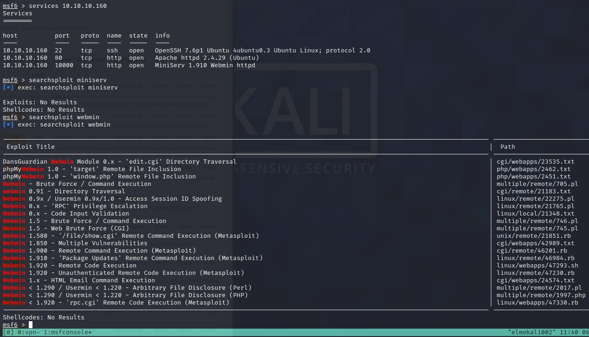

## Kohta k /// Korkkaa jokin HTB:n kone

# Lähteet

1. [Tero Karvinen](http://terokarvinen.com/2020/tunkeutumistestaus-kurssi-pentest-course-ict4tn027-3006-autumn-2020/)
2. [Sourceforge](https://sourceforge.net/projects/metasploitable/)
3. [Securing Ninja](https://securingninja.com/how-to-install-metasploitable-in-virtualbox/)
4. [rapid7](https://www.rapid7.com/db/modules/exploit/unix/ftp/vsftpd_234_backdoor/)
5. [cvedetails](https://www.cvedetails.com/vulnerability-list/vendor_id-45/product_id-66/version_id-40007/Apache-Http-Server-2.2.3.html)
6. [Jaswal 2020: Mastering Metasploit - 4ed](https://www.oreilly.com/library/view/mastering-metasploit-/9781838980078/B15076_01_Final_ASB_ePub.xhtml#_idParaDest-30
)