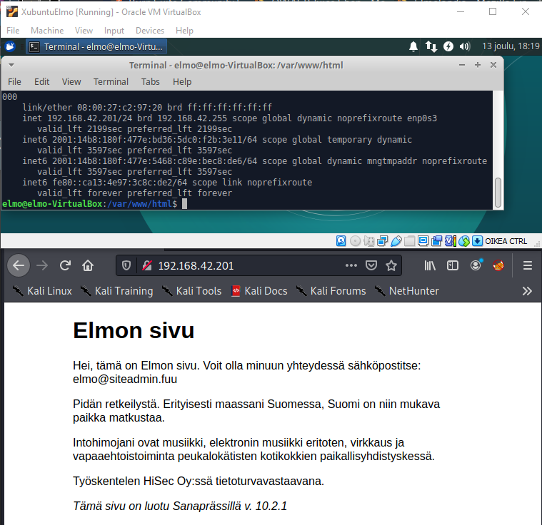

# Harjoitus 6

Tehtävänanto kokonaisuudessaan löytyy Tero Karvisen nettisivuilta, kohta **H6** [(linkki)](http://terokarvinen.com/2020/tunkeutumistestaus-kurssi-pentest-course-ict4tn027-3006-autumn-2020/).

## Kohta a, palauta kaikki

### Kaikki tehtävät

### [Harjoitus 1](../Harjoitus1/Text.md)

### [Harjoitus 2](../Harjoitus2/Text.md)

### [Harjoitus 3](../Harjoitus3/Text.md)

### [Harjoitus 4](../Harjoitus4/Text.md)

### [Harjoitus 5](../Harjoitus5/Text.md)

## Kohta c, tee 5 tiivistettä eri ohjelmilla ja arvaa ne hashcatilla

Aloitin tehtävän asentamalla **hashcatin** omalle pöytäkoneelleni, jotta saisin käytettyä näytönohjaintani. Ohjelmisto löytyy [täältä.](https://hashcat.net/hashcat/). Asennus tapahtuu purkamalla tiedostot johonkin hakemistoon.

Seuraavaksi loin **md5** tiivisteen sanasta **elmo** Kali-virtuaalikoneella.

    $ echo -n "elmo"|md5sum

*-n -parametri poistaa tulosteesta ***newlinen***, jolloin md5sum ei ota sitä mukaan tiivisteeseen [(linkki ohjeeseen (askubuntu))](https://askubuntu.com/questions/53846/how-to-get-the-md5-hash-of-a-string-directly-in-the-terminal)*

Tallensin tulosteen myös erilliseen tekstitiedostoon Windows-koneellani. Seuraavaksi ajoin **hashcatin** tiivistettä vastaan

    > U:\Kouluhommat\hashcat-6.1.1>hashcat.exe -a 3 -m 0 test.txt

Ajan siis hashcatin bruteforcena (-a 3), md5-tiivistettä vastaan (-m 0) ja kohdetiedosto on test.txt, jossa yhdellä rivillä aiemmin luoma tiivisteeni.

*hashcat --help on kätevä!!*

Nopeus on hurja! Olen aika varma, että koneeni valehtelee. Hashcat ilmoittaa 2061 **MILJOONAA** kokeilua sekunnissa.

Kuten näkyy, tulokseksi saatiin **"elmo"**.

Kokeilin myös sanakirjahyökkäystä **rockyou.txt**:n avulla. Loin uuden md5-tiivisteen salasanasta **password123**.

    > hashcat.exe -a 0 -m 0 test.txt rockyou.txt

Parametri (-a 0) ajaa sanakirjahyökkäyksen, (-m 0) md5-tiivistettä vastaan. Kohde tiedostossa **test.txt** ja sanalista **rockyou.txt**. Salasana murtui hyvin nopeasti.

Seuraavaksi loin **sha256**-tiivisteen sanasta **testi123**. Halusin kokeilla, kuinka kauan menee bruteforcella 8-merkkisen sanan ratkaisuun. Spoiler alert: ei kauaa.

    $ echo -n "testi123" | sha256sum
    > hashcat.exe -a 3 -m 1400 test.txt

*-m 1400 kertoo hashcatille, että kyseessä sha256*

Aikaa kului hieman alle 2 minuuttia salasanan murtamiseen. Huomioitavaa tässä on myös se, että mikä tahansa 8-merkkinen salasana sha256-tiivistettynä ilman suolaa murtuisi varmaan samassa ajassa omalla koneellani, koska kyseessä bruteforce.

Loin myös **sha512**-tiivisteen ja mursin sen.

    $ echo -n "testi" | sha512sum
    > hashcat.exe -a 3 -m 1700 test.txt

## Kohta d, kokeile hydraa johonkin uuteen maaliin

Käynnistin taustalle **Metasploitable 2** harjoitusmaalin. Koneen käynnistyttyä testasin pingillä yhteyden, sekä ajoin **nmapin** konetta vastaan hyökkäyskoneelta katsoakseni mitä palveluita koneesta löytyisi avoinna.

    $ ping 192.168.42.94
    $ nmap -sV --reason 192.168.42.94 -oA msfmap

Ajattelin kokeilla murtautua **ftp**-palveluun. Ajoin **hydran** seuraavalla komennolla:

    $ hydra -L /usr/share/wordlists/metasploit/unix_users.txt -P /usr/share/wordlists/metasploit/unix_passwords.txt ftp://192.168.b42.94 -I -V -u -F -t 64

Komento koostuu seuraavista:

 * -L /usr/sha.... - kertoo, että tullaan käyttämään listaa mahdollisista käyttänimistä ja seuraavaksi sanalistan sijainti
 * -P - sama kuin *-L*, mutta salasanoille
 * ftp://192.168.b42.94 - kertoo palvelun, sekä kohdekoneen IP:n. Käyttää annetun palvelun vakioporttia, ellei sitä erikseen mainita toiseksi (ftp -> portti 21)
 * -I - Hydra on huomioimatta mahdollisia aikaisempia ajoja, eikä herjaa niistä
 * -V - Korkeahko verbositetti (tulostaa paljon tietoa)
 * -u - Kokeilee yhtä salasanaa per käyttäjä
 * -F - Lopettaa heti, kun löytää jonkin toimivan käyttäjä:salasana yhdistelmän
 - -t 64 - Kertoo kuinka monta yritystä tullaan ajamaan rinnan. Laitoin maksimimäärän 64, sillä virtuaalikoneella ajaminen suhteellisen hidasta.

Saimme haaviimme **ftp**-tunnukset! Käyttäjä: **ftp**, salasana: **admin**

Kokeilin vielä kirjautumista kohdemaaliin saamillani tunnuksilla ja se onnistui!

    $ ftp 192.168.42.94

## Kohta e, Kokeile hydraa omaan weppilomakkeeseen

Käynnistin uuden kohdekoneen, jossa tulisin pyörittämään **JuiceShoppia**. Olin joskus aikaisemmin saanut säädettyä **JuiceShopin** joten sen käynnistäminen taustalle oli helppoa. Kokeilin hyökkäyskoneellani näkyisikö **JuiceShop** kohdekoneen portissa 3000 ja kyllä näkyi!

Selatessa palvelun etusivua ja lukemalla "tuotearvosteluja" käy ilmi, että niissä näkyvät myös sähköpostiosoitteet, jonka "arvostelun" kirjoittaja on antanut. Löysin mm. mielenkiintoisen **admin@juice-sh.op**-osoitteen. Voimme kokeilla tätä lomakkeelle murtautuessa.

Huomasin yrittäessäni testikirjautumista, että tiedot menevät palvelimelle **POST**-pyynnössä ja vieläpä **JSON**:na.

Yritin seuraavaksi ajaa **hydraa** niin, että käyttäisin löytämääni sähköpostia käyttäjätunnuksena, sekä sanalistaa salasanojen tilalla

    $ hydra -l "admin@juice-sh.op" -P /usr/share/wordlists/metasploit/unix_passwords.txt 192.168.42.201:3000 http-post-form "/rest/user/login:{\"email\":\"admin@juice-sh.op\",\"password\":\"^PASS^\"}"

Se ei mennyt läpi vaan antaa virheilmoitusta. En ollut oikein varma tuosta, joten päätin lueskella lisää aiheesta.

Löysin aiheesta keskustelua [security.stackexchangessa](https://security.stackexchange.com/questions/57839/hydra-bruteforce-and-json), mutten oikein ymmärtänyt asiasta sen enempää. En tiedä, kuinka olisin soveltanut tuolta löytyvää tietoa omaan ongelmaani.

Löysin myös [mielenkiintoisen artikkelin (redteamtutorials)](https://redteamtutorials.com/2018/10/25/hydra-brute-force-https/), jossa yritettiin murtautua kirjautumislomakkeelle, joka ei käyttänyt JSONia. Vastaavanlainen hyökkäys olisi varmaankin helpommin onnistunut, mutten ole kummoinen webbikoodari, enkä tiennyt, millä hakea harjoitusmaaleja, joissa kyseisen tyylinen kirjautumislomake.

## kohta f, Tee oma sanalista itse tekemästäsi ja keksimästäsi weppisivusta

Loin aluksi kevyen testisivun **nginx**-vakiosivun päälle kohdekoneessani. Kohdekone on sama, kuin missä aikaisemmin pyöri **JuiceShop**. Kävin hyökkäyskoneella katsomassa, että kohdekoneen sivu näkyi ulospäin.

Seuraavaksi ajoin komennon

    $ cewl -e -a -w elmosivulista 192.168.42.201

jolla saisin sanalistan aikaiseksi. Komennosta huomioitavaa:

  * -e - sisällyttää tuloksiin sähköpostit erikseen
  * -a - sisällyttää tuloksiin metadatan
  * -w (tiedostonimi) - tulostaa tulokset tiedostoon

**Cewl** sai hienosti napattua kaiken, kirjoitusvirheitä myöten. Huomioitavaa myös, että tulokset sisälsivät erikseen **cewlin** löytämän sähköpostiosoitteen. Vakiona **cewl** jättää alle 3 merkkiset sanat pois tuloksista. Käytin [cewlin man sivuja (manpages.org)](http://manpages.org/cewl)
 apuna.

## kohta h, Joukkoäly

Dirsearchin käyttö [(Janica Fagerholm)](https://janicafagerblom.wordpress.com/2020/12/06/tehtava-5/), en ollut itse törmännyt työkaluun aikaisemmin, joten tämä olisi jotain, mitä voisi tulevaisuudessa kokeilla.

LinPEAs käyttö [(Patrik Sulander)](https://patriksulander.law.blog/2020/11/30/tunkeutumistestaus-ict4tn027-3006-h4/). Privesc työkalu, joka itselle tuntematon. Vaikuttaa mielenkiintoiselta.

# Lähteet

1. [Tero Karvinen](http://terokarvinen.com/2020/tunkeutumistestaus-kurssi-pentest-course-ict4tn027-3006-autumn-2020/)
2. [AskUbuntu](https://askubuntu.com/questions/53846/how-to-get-the-md5-hash-of-a-string-directly-in-the-terminal)
3. [Juiceshop](https://owasp.org/www-project-juice-shop/)
4. [Juiceshopin asennusohjeet](https://hub.docker.com/r/bkimminich/juice-shop)
5. [StackExchange](https://security.stackexchange.com/questions/57839/hydra-bruteforce-and-json)
6. [redteamtutorials](https://redteamtutorials.com/2018/10/25/hydra-brute-force-https/)
7. [manpages](http://manpages.org/cewl)
8. [Janica Fagerholm](https://janicafagerblom.wordpress.com/2020/12/06/tehtava-5/)
9. [Patrik Sulander](https://patriksulander.law.blog/2020/11/30/tunkeutumistestaus-ict4tn027-3006-h4/)