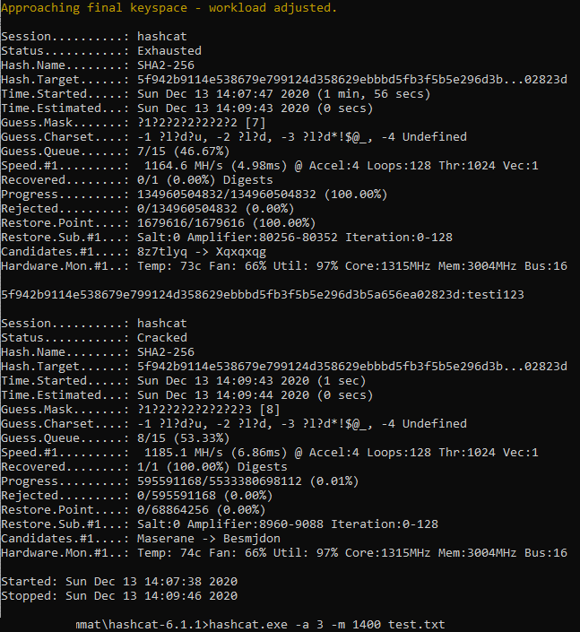

# Harjoitus 6

Tehtävänanto kokonaisuudessaan löytyy Tero Karvisen nettisivuilta, kohta **H6** [(linkki)](http://terokarvinen.com/2020/tunkeutumistestaus-kurssi-pentest-course-ict4tn027-3006-autumn-2020/).

## Kohta a, palauta kaikki

### Kaikki tehtävät

### [Harjoitus 1](../Harjoitus1/Text.md)

### [Harjoitus 2](../Harjoitus2/Text.md)

### [Harjoitus 3](../Harjoitus3/Text.md)

### [Harjoitus 4](../Harjoitus4/Text.md)

### [Harjoitus 5](../Harjoitus5/Text.md)

## Kohta c, tee 5 tiivistettä eri ohjelmilla ja arvaa ne hashcatilla

Aloitin tehtävän asentamalla **hashcatin** omalle pöytäkoneelleni, jotta saisin käytettyä näytönohjaintani. Ohjelmisto löytyy [täältä.](https://hashcat.net/hashcat/). Asennus tapahtuu purkamalla tiedostot johonkin hakemistoon.

Seuraavaksi loin **md5** tiivisteen sanasta **elmo** Kali-virtuaalikoneella.

    $ echo -n "elmo"|md5sum

*-n -parametri poistaa tulosteesta ***newlinen***, jolloin md5sum ei ota sitä mukaan tiivisteeseen*

Tallensin tulosteen myös erilliseen tekstitiedostoon Windows-koneellani. Seuraavaksi ajoin **hashcatin** tiivistettä vastaan

    > U:\Kouluhommat\hashcat-6.1.1>hashcat.exe -a 3 -m 0 test.txt

Ajan siis hashcatin bruteforcena (-a 3), md5-tiivistettä vastaan (-m 0) ja kohdetiedosto on test.txt, jossa yhdellä rivillä aiemmin luoma tiivisteeni.

*hashcat --help on kätevä!!*

Nopeus on hurja! Olen aika varma, että koneeni valehtelee. Hashcat ilmoittaa 2061 **MILJOONAA** kokeilua sekunnissa.

Kuten näkyy, tulokseksi saatiin **"elmo"**.

Kokeilin myös sanakirjahyökkäystä **rockyou.txt**:n avulla. Loin uuden md5-tiivisteen salasanasta **password123**.

    > hashcat.exe -a 0 -m 0 test.txt rockyou.txt

Parametri (-a 0) ajaa sanakirjahyökkäyksen, (-m 0) md5-tiivistettä vastaan. Kohde tiedostossa **test.txt** ja sanalista **rockyou.txt**. Salasana murtui hyvin nopeasti.

## Kohta d, kokeile hydraa johonkin uuteen maaliin

## Kohta e

## kohta f

## kohta g

## kohta h